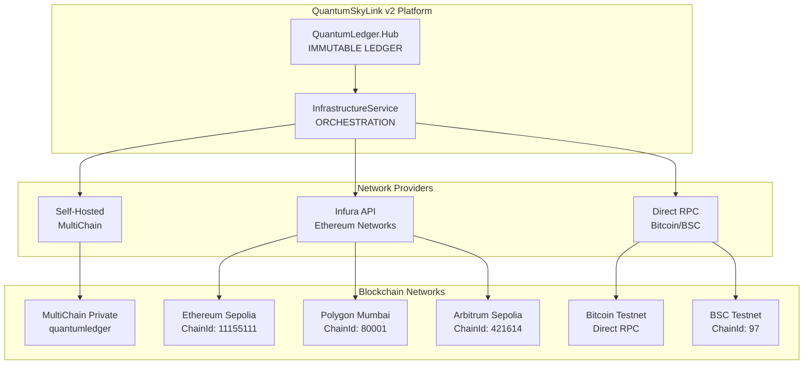

# Multi-Network Configuration Guide - QuantumSkyLink v2

## Overview

This guide provides comprehensive configuration instructions for QuantumSkyLink v2's multi-network blockchain architecture, supporting 6 blockchain networks through multiple providers: private (MultiChain), Infura (Ethereum-based), and direct connections (Bitcoin, BSC).

## Network Architecture Overview



## Network Configuration Matrix

| Network | Provider | Endpoint | ChainId | Currency | Type |
|---------|----------|----------|---------|----------|------|
| **MultiChain** | Self-hosted | localhost:7446 | - | Custom | Private |
| **Sepolia** | Infura | sepolia.infura.io/v3/{API_KEY} | 11155111 | ETH | Ethereum Testnet |
| **Mumbai** | Infura | polygon-mumbai.infura.io/v3/{API_KEY} | 80001 | MATIC | Polygon Testnet |
| **Arbitrum Sepolia** | Infura | arbitrum-sepolia.infura.io/v3/{API_KEY} | 421614 | ETH | Layer 2 Testnet |
| **Bitcoin Testnet** | Direct | testnet.blockstream.info/api | - | BTC | Bitcoin Testnet |
| **BSC Testnet** | Direct | data-seed-prebsc-1-s1.binance.org:8545 | 97 | BNB | Binance Testnet |

## Environment Configuration

### 1. Infura Setup

#### Create Infura Account
1. Visit [https://infura.io](https://infura.io)
2. Create account and verify email
3. Create new project: "QuantumSkyLink-v2"
4. Copy Project ID from dashboard

#### Configure Infura Networks
Enable these networks in your Infura project:
- **Ethereum Sepolia** (Testnet)
- **Polygon Mumbai** (Testnet)
- **Arbitrum Sepolia** (Testnet)

### 2. Application Configuration

#### appsettings.json (InfrastructureService)

```json
{
  "Logging": {
    "LogLevel": {
      "Default": "Information",
      "Microsoft.AspNetCore": "Warning",
      "Microsoft.EntityFrameworkCore": "Warning"
    }
  },
  "AllowedHosts": "*",
  "Blockchain": {
    "MultiChain": {
      "RpcUrl": "http://localhost:7446",
      "ChainName": "quantumledger",
      "Username": "multichainrpc",
      "Password": "multichainpass"
    },
    "Infura": {
      "ProjectId": "${INFURA_PROJECT_ID}",
      "ProjectSecret": "${INFURA_PROJECT_SECRET}",
      "Networks": {
        "Sepolia": {
          "RpcUrl": "https://sepolia.infura.io/v3/${INFURA_PROJECT_ID}",
          "ChainId": 11155111,
          "Currency": "ETH",
          "IsTestnet": true
        },
        "Mumbai": {
          "RpcUrl": "https://polygon-mumbai.infura.io/v3/${INFURA_PROJECT_ID}",
          "ChainId": 80001,
          "Currency": "MATIC",
          "IsTestnet": true
        },
        "ArbitrumSepolia": {
          "RpcUrl": "https://arbitrum-sepolia.infura.io/v3/${INFURA_PROJECT_ID}",
          "ChainId": 421614,
          "Currency": "ETH",
          "IsTestnet": true
        }
      }
    },
    "Direct": {
      "Networks": {
        "BitcoinTestnet": {
          "RpcUrl": "https://testnet.blockstream.info/api",
          "Currency": "BTC",
          "IsTestnet": true,
          "AddressFormats": ["P2PKH", "P2SH", "Bech32"]
        },
        "BSCTestnet": {
          "RpcUrl": "https://data-seed-prebsc-1-s1.binance.org:8545",
          "ChainId": 97,
          "Currency": "BNB",
          "IsTestnet": true
        }
      }
    }
  },
  "NetworkConfiguration": {
    "DefaultTimeout": 30000,
    "MaxRetries": 3,
    "HealthCheckInterval": 60000,
    "EnableNetworkSwitching": true,
    "PreferredNetworks": ["MultiChain", "Sepolia", "Mumbai"]
  }
}
```

#### Environment Variables

Create `.env` file in project root:

```bash
# Infura Configuration
INFURA_PROJECT_ID=your_infura_project_id_here
INFURA_PROJECT_SECRET=your_infura_project_secret_here

# MultiChain Configuration
MULTICHAIN_RPC_PASSWORD=multichainpass
MULTICHAIN_RPC_USER=multichainrpc

# Network Configuration
ENABLE_TESTNET_ONLY=true
DEFAULT_NETWORK=MultiChain

# Security Configuration
SIGNATURE_VALIDATION_ENABLED=true
LEDGER_VALIDATION_ENABLED=true
```

### 3. Aspire AppHost Configuration

#### AppHost.cs Updates

```csharp
var builder = DistributedApplication.CreateBuilder(args);

// Infrastructure Services
var redis = builder.AddRedis("cache");
var rabbitmq = builder.AddRabbitMQ("messaging");

// Database connections (existing)
var postgresInfrastructureService = builder.AddConnectionString("postgres-infrastructureservice");
var postgresQuantumLedgerHub = builder.AddConnectionString("postgres-quantumledgerhub");
var postgresSignatureService = builder.AddConnectionString("postgres-signatureservice");

// External Service Parameters
var infuraProjectId = builder.AddParameter("infura-project-id", secret: true);
var infuraProjectSecret = builder.AddParameter("infura-project-secret", secret: true);
var multichainRpcPassword = builder.AddParameter("multichain-rpc-password", secret: true);

// Multi-Network Blockchain Configuration
var multichain = builder.AddConnectionString("multichain-external", "http://localhost:7446");

// Infura Network Connections
var infuraSepolia = builder.AddConnectionString("infura-sepolia", 
    $"https://sepolia.infura.io/v3/{infuraProjectId}");
var infuraMumbai = builder.AddConnectionString("infura-mumbai", 
    $"https://polygon-mumbai.infura.io/v3/{infuraProjectId}");
var infuraArbitrumSepolia = builder.AddConnectionString("infura-arbitrum-sepolia", 
    $"https://arbitrum-sepolia.infura.io/v3/{infuraProjectId}");

// Direct Network Connections
var bitcoinTestnet = builder.AddConnectionString("bitcoin-testnet", 
    "https://testnet.blockstream.info/api");
var bscTestnet = builder.AddConnectionString("bsc-testnet", 
    "https://data-seed-prebsc-1-s1.binance.org:8545");

// Core Services
var signatureService = builder.AddProject<Projects.SignatureService>("signatureservice")
    .WithReference(postgresSignatureService)
    .WithReference(redis);

var quantumLedgerHub = builder.AddProject<Projects.QuantumLedger_Hub>("quantumledgerhub")
    .WithReference(postgresQuantumLedgerHub)
    .WithReference(rabbitmq)
    .WithReference(signatureService)
    .WithReference(multichain)
    .WithReplicas(3);

// Enhanced InfrastructureService with Multi-Network Support
var infrastructureService = builder.AddProject<Projects.InfrastructureService>("infrastructureservice")
    .WithReference(postgresInfrastructureService)
    .WithReference(redis)
    .WithReference(quantumLedgerHub)
    .WithReference(multichain)           // Network 1: MultiChain Private
    .WithReference(infuraSepolia)        // Network 2: Ethereum Sepolia
    .WithReference(infuraMumbai)         // Network 3: Polygon Mumbai
    .WithReference(infuraArbitrumSepolia) // Network 4: Arbitrum Sepolia
    .WithReference(bitcoinTestnet)       // Network 5: Bitcoin Testnet
    .WithReference(bscTestnet)           // Network 6: BSC Testnet
    .WithEnvironment("INFURA_PROJECT_ID", infuraProjectId)
    .WithEnvironment("INFURA_PROJECT_SECRET", infuraProjectSecret)
    .WithEnvironment("MULTICHAIN_RPC_PASSWORD", multichainRpcPassword);

// All other services must reference QuantumLedger.Hub and SignatureService
var paymentGatewayService = builder.AddProject<Projects.PaymentGatewayService>("paymentgatewayservice")
    .WithReference(postgresPaymentGatewayService)
    .WithReference(rabbitmq)
    .WithReference(quantumLedgerHub)     // MANDATORY
    .WithReference(signatureService);    // MANDATORY

// Repeat for all services...

builder.Build().Run();
```

## Service Implementation

### 1. Multi-Network Service Configuration

#### IMultiNetworkConfiguration Interface

```csharp
public interface IMultiNetworkConfiguration
{
    NetworkConfig GetNetworkConfig(string networkType);
    List<NetworkConfig> GetAllNetworks();
    List<NetworkConfig> GetTestnetworks();
    bool IsNetworkEnabled(string networkType);
    string GetPreferredNetwork(string operation);
}

public class NetworkConfig
{
    public string NetworkType { get; set; }
    public string DisplayName { get; set; }
    public string RpcUrl { get; set; }
    public int? ChainId { get; set; }
    public string Currency { get; set; }
    public bool IsTestnet { get; set; }
    public string Provider { get; set; } // "Infura", "Direct", "SelfHosted"
    public Dictionary<string, string> Properties { get; set; }
    public List<string> Capabilities { get; set; }
}
```

#### MultiNetworkConfiguration Implementation

```csharp
public class MultiNetworkConfiguration : IMultiNetworkConfiguration
{
    private readonly IConfiguration _configuration;
    private readonly Dictionary<string, NetworkConfig> _networks;
    
    public MultiNetworkConfiguration(IConfiguration configuration)
    {
        _configuration = configuration;
        _networks = LoadNetworkConfigurations();
    }
    
    private Dictionary<string, NetworkConfig> LoadNetworkConfigurations()
    {
        var networks = new Dictionary<string, NetworkConfig>();
        
        // MultiChain Configuration
        networks["MULTICHAIN"] = new NetworkConfig
        {
            NetworkType = "MULTICHAIN",
            DisplayName = "MultiChain Private",
            RpcUrl = _configuration["Blockchain:MultiChain:RpcUrl"],
            Currency = "Custom",
            IsTestnet = false,
            Provider = "SelfHosted",
            Properties = new Dictionary<string, string>
            {
                ["ChainName"] = _configuration["Blockchain:MultiChain:ChainName"],
                ["Username"] = _configuration["Blockchain:MultiChain:Username"],
                ["Password"] = _configuration["Blockchain:MultiChain:Password"]
            },
            Capabilities = new List<string> { "PrivateBlockchain", "CustomAssets", "Permissions" }
        };
        
        // Infura Networks
        var infuraProjectId = _configuration["Blockchain:Infura:ProjectId"];
        
        networks["SEPOLIA"] = new NetworkConfig
        {
            NetworkType = "SEPOLIA",
            DisplayName = "Ethereum Sepolia",
            RpcUrl = $"https://sepolia.infura.io/v3/{infuraProjectId}",
            ChainId = 11155111,
            Currency = "ETH",
            IsTestnet = true,
            Provider = "Infura",
            Capabilities = new List<string> { "SmartContracts", "ERC20", "ERC721" }
        };
        
        networks["MUMBAI"] = new NetworkConfig
        {
            NetworkType = "MUMBAI",
            DisplayName = "Polygon Mumbai",
            RpcUrl = $"https://polygon-mumbai.infura.io/v3/{infuraProjectId}",
            ChainId = 80001,
            Currency = "MATIC",
            IsTestnet = true,
            Provider = "Infura",
            Capabilities = new List<string> { "SmartContracts", "ERC20", "ERC721", "LowFees" }
        };
        
        networks["ARBITRUM_SEPOLIA"] = new NetworkConfig
        {
            NetworkType = "ARBITRUM_SEPOLIA",
            DisplayName = "Arbitrum Sepolia",
            RpcUrl = $"https://arbitrum-sepolia.infura.io/v3/{infuraProjectId}",
            ChainId = 421614,
            Currency = "ETH",
            IsTestnet = true,
            Provider = "Infura",
            Capabilities = new List<string> { "SmartContracts", "ERC20", "ERC721", "Layer2" }
        };
        
        // Direct Networks
        networks["BITCOIN_TESTNET"] = new NetworkConfig
        {
            NetworkType = "BITCOIN_TESTNET",
            DisplayName = "Bitcoin Testnet",
            RpcUrl = _configuration["Blockchain:Direct:Networks:BitcoinTestnet:RpcUrl"],
            Currency = "BTC",
            IsTestnet = true,
            Provider = "Direct",
            Capabilities = new List<string> { "UTXO", "P2PKH", "P2SH", "Bech32" }
        };
        
        networks["BSC_TESTNET"] = new NetworkConfig
        {
            NetworkType = "BSC_TESTNET",
            DisplayName = "BSC Testnet",
            RpcUrl = _configuration["Blockchain:Direct:Networks:BSCTestnet:RpcUrl"],
            ChainId = 97,
            Currency = "BNB",
            IsTestnet = true,
            Provider = "Direct",
            Capabilities = new List<string> { "SmartContracts", "BEP20", "BEP721", "FastTransactions" }
        };
        
        return networks;
    }
    
    public NetworkConfig GetNetworkConfig(string networkType)
    {
        return _networks.GetValueOrDefault(networkType.ToUpperInvariant());
    }
    
    public List<NetworkConfig> GetAllNetworks()
    {
        return _networks.Values.ToList();
    }
    
    public List<NetworkConfig> GetTestnetworks()
    {
        return _networks.Values.Where(n => n.IsTestnet).ToList();
    }
    
    public bool IsNetworkEnabled(string networkType)
    {
        var config = GetNetworkConfig(networkType);
        return config != null && !string.IsNullOrEmpty(config.RpcUrl);
    }
    
    public string GetPreferredNetwork(string operation)
    {
        var preferredNetworks = _configuration.GetSection("NetworkConfiguration:PreferredNetworks")
            .Get<string[]>() ?? new[] { "MULTICHAIN" };
            
        foreach (var network in preferredNetworks)
        {
            if (IsNetworkEnabled(network))
            {
                return network;
            }
        }
        
        return "MULTICHAIN"; // Fallback
    }
}
```

### 2. Network Provider Services

#### InfuraNetworkService

```csharp
public interface IInfuraNetworkService
{
    Task<NetworkHealthStatus> GetNetworkHealthAsync(string network, CancellationToken cancellationToken = default);
    Task<decimal> GetGasPriceAsync(string network, CancellationToken cancellationToken = default);
    Task<long> GetBlockNumberAsync(string network, CancellationToken cancellationToken = default);
    Task<bool> TestConnectivityAsync(string network, CancellationToken cancellationToken = default);
}

public class InfuraNetworkService : IInfuraNetworkService
{
    private readonly HttpClient _httpClient;
    private readonly IMultiNetworkConfiguration _networkConfig;
    private readonly ILogger<InfuraNetworkService> _logger;
    
    public InfuraNetworkService(
        HttpClient httpClient,
        IMultiNetworkConfiguration networkConfig,
        ILogger<InfuraNetworkService> logger)
    {
        _httpClient = httpClient;
        _networkConfig = networkConfig;
        _logger = logger;
    }
    
    public async Task<NetworkHealthStatus> GetNetworkHealthAsync(string network, CancellationToken cancellationToken = default)
    {
        try
        {
            var config = _networkConfig.GetNetworkConfig(network);
            if (config?.Provider != "Infura")
            {
                return new NetworkHealthStatus { IsHealthy = false, Message = "Not an Infura network" };
            }
            
            var blockNumber = await GetBlockNumberAsync(network, cancellationToken);
            var gasPrice = await GetGasPriceAsync(network, cancellationToken);
            
            return new NetworkHealthStatus
            {
                IsHealthy = blockNumber > 0 && gasPrice > 0,
                BlockHeight = blockNumber,
                GasPrice = gasPrice,
                CheckedAt = DateTime.UtcNow,
                NetworkType = network
            };
        }
        catch (Exception ex)
        {
            _logger.LogError(ex, "Error checking network health for {Network}", network);
            return new NetworkHealthStatus
            {
                IsHealthy = false,
                Message = ex.Message,
                CheckedAt = DateTime.UtcNow,
                NetworkType = network
            };
        }
    }
    
    public async Task<long> GetBlockNumberAsync(string network, CancellationToken cancellationToken = default)
    {
        var config = _networkConfig.GetNetworkConfig(network);
        var request = new
        {
            jsonrpc = "2.0",
            method = "eth_blockNumber",
            @params = new object[0],
            id = 1
        };
        
        var response = await _httpClient.PostAsJsonAsync(config.RpcUrl, request, cancellationToken);
        var result = await response.Content.ReadFromJsonAsync<JsonRpcResponse<string>>(cancellationToken: cancellationToken);
        
        return Convert.ToInt64(result.Result, 16);
    }
    
    public async Task<decimal> GetGasPriceAsync(string network, CancellationToken cancellationToken = default)
    {
        var config = _networkConfig.GetNetworkConfig(network);
        var request = new
        {
            jsonrpc = "2.0",
            method = "eth_gasPrice",
            @params = new object[0],
            id = 1
        };
        
        var response = await _httpClient.PostAsJsonAsync(config.RpcUrl, request, cancellationToken);
        var result = await response.Content.ReadFromJsonAsync<JsonRpcResponse<string>>(cancellationToken: cancellationToken);
        
        var gasPriceWei = Convert.ToInt64(result.Result, 16);
        return gasPriceWei / 1_000_000_000m; // Convert to Gwei
    }
    
    public async Task<bool> TestConnectivityAsync(string network, CancellationToken cancellationToken = default)
    {
        try
        {
            var blockNumber = await GetBlockNumberAsync(network, cancellationToken);
            return blockNumber > 0;
        }
        catch
        {
            return false;
        }
    }
}
```

#### BitcoinNetworkService

```csharp
public interface IBitcoinNetworkService
{
    Task<BitcoinNetworkInfo> GetNetworkInfoAsync(CancellationToken cancellationToken = default);
    Task<decimal> GetBalanceAsync(string address, CancellationToken cancellationToken = default);
    Task<bool> ValidateAddressAsync(string address, CancellationToken cancellationToken = default);
    Task<long> GetBlockHeightAsync(CancellationToken cancellationToken = default);
}

public class BitcoinNetworkService : IBitcoinNetworkService
{
    private readonly HttpClient _httpClient;
    private readonly IMultiNetworkConfiguration _networkConfig;
    private readonly ILogger<BitcoinNetworkService> _logger;
    
    public BitcoinNetworkService(
        HttpClient httpClient,
        IMultiNetworkConfiguration networkConfig,
        ILogger<BitcoinNetworkService> logger)
    {
        _httpClient = httpClient;
        _networkConfig = networkConfig;
        _logger = logger;
    }
    
    public async Task<long> GetBlockHeightAsync(CancellationToken cancellationToken = default)
    {
        var config = _networkConfig.GetNetworkConfig("BITCOIN_TESTNET");
        var response = await _httpClient.GetAsync($"{config.RpcUrl}/blocks/tip/height", cancellationToken);
        var heightString = await response.Content.ReadAsStringAsync(cancellationToken);
        return long.Parse(heightString);
    }
    
    public async Task<decimal> GetBalanceAsync(string address, CancellationToken cancellationToken = default)
    {
        var config = _networkConfig.GetNetworkConfig("BITCOIN_TESTNET");
        var response = await _httpClient.GetAsync($"{config.RpcUrl}/address/{address}", cancellationToken);
        var addressInfo = await response.Content.ReadFromJsonAsync<BitcoinAddressInfo>(cancellationToken: cancellationToken);
        return addressInfo.ChainStats.FundedTxoSum / 100_000_000m; // Convert satoshis to BTC
    }
    
    public async Task<bool> ValidateAddressAsync(string address, CancellationToken cancellationToken = default)
    {
        try
        {
            // Use NBitcoin library for address validation
            var network = NBitcoin.Network.TestNet;
            var bitcoinAddress = BitcoinAddress.Create(address, network);
            return bitcoinAddress != null;
        }
        catch
        {
            return false;
        }
    }
}
```

## Network Testing Configuration

### 1. Health Check Configuration

```csharp
// In Program.cs
builder.Services.AddHealthChecks()
    .AddCheck<MultiChainHealthCheck>("multichain")
    .AddCheck<InfuraHealthCheck>("infura-sepolia", tags: new[] { "infura", "ethereum" })
    .AddCheck<InfuraHealthCheck>("infura-mumbai", tags: new[] { "infura", "polygon" })
    .AddCheck<InfuraHealthCheck>("infura-arbitrum", tags: new[] { "infura", "arbitrum" })
    .AddCheck<BitcoinHealthCheck>("bitcoin-testnet", tags: new[] { "bitcoin" })
    .AddCheck<BSCHealthCheck>("bsc-testnet", tags: new[] { "bsc" });
```

### 2. Network Monitoring

```csharp
public class NetworkMonitoringService : BackgroundService
{
    private readonly IMultiNetworkConfiguration _networkConfig;
    private readonly IInfuraNetworkService _infuraService;
    private readonly IBitcoinNetworkService _bitcoinService;
    private readonly ILogger<NetworkMonitoringService> _logger;
    
    protected override async Task ExecuteAsync(CancellationToken stoppingToken)
    {
        while (!stoppingToken.IsCancellationRequested)
        {
            await MonitorAllNetworksAsync(stoppingToken);
            await Task.Delay(TimeSpan.FromMinutes(1), stoppingToken);
        }
    }
    
    private async Task MonitorAllNetworksAsync(CancellationToken cancellationToken)
    {
        var networks = _networkConfig.GetAllNetworks();
        var tasks = networks.Select(network => MonitorNetworkAsync(network, cancellationToken));
        await Task.WhenAll(tasks);
    }
    
    private async Task MonitorNetworkAsync(NetworkConfig network, CancellationToken cancellationToken)
    {
        try
        {
            NetworkHealthStatus health = network.Provider switch
            {
                "Infura" => await _infuraService.GetNetworkHealthAsync(network.NetworkType, cancellationToken),
                "Direct" when network.NetworkType == "BITCOIN_TESTNET" => await GetBitcoinHealthAsync(cancellationToken),
                "SelfHosted" => await GetMultiChainHealthAsync(cancellationToken),
                _ => new NetworkHealthStatus { IsHealthy = false, Message = "Unknown provider" }
            };
            
            _logger.LogInformation("Network {Network} health: {IsHealthy}", 
                network.NetworkType, health.IsHealthy);
        }
        catch (Exception ex)
        {
            _logger.LogError(ex, "Error monitoring network {Network}", network.NetworkType);
        }
    }
}
```

## Deployment Configuration

### 1. Docker Compose Integration

```yaml
# docker-compose.override.yml
version: '3.8'

services:
  infrastructureservice:
    environment:
      - INFURA_PROJECT_ID=${INFURA_PROJECT_ID}
      - INFURA_PROJECT_SECRET=${INFURA_PROJECT_SECRET}
      - MULTICHAIN_RPC_PASSWORD=${MULTICHAIN_RPC_PASSWORD}
      - ENABLE_TESTNET_ONLY=true
    depends_on:
      - multichain-master
      - redis
      - postgres
    networks:
      - quantumskylink-network
      - multichain-network

  multichain-master:
    networks:
      - multichain-network
    ports:
      - "7446:7446"
      - "7447:7447"

networks:
  multichain-network:
    external: true
  quantumskylink-network:
    driver: bridge
```

### 2. Kubernetes Configuration

```yaml
# k8s/infrastructure-service-configmap.yaml
apiVersion: v1
kind: ConfigMap
metadata:
  name: infrastructure-service-config
data:
  appsettings.json: |
    {
      "Blockchain": {
        "MultiChain": {
          "RpcUrl": "http://multichain-service:7446"
        },
        "NetworkConfiguration": {
          "DefaultTimeout": 30000,
          "MaxRetries": 3,
          "HealthCheckInterval": 60000
        }
      }
    }

---
apiVersion: v1
kind: Secret
metadata:
  name: infrastructure-service-secrets
type: Opaque
stringData:
  INFURA_PROJECT_ID: "your-infura-project-id"
  INFURA_PROJECT_SECRET: "your-infura-project-secret"
  MULTICHAIN_RPC_PASSWORD: "your-multichain-password"
```

## Testing and Validation

### 1. Network Connectivity Tests

```csharp
[TestClass]
public class MultiNetworkConnectivityTests
{
    private IMultiNetworkConfiguration _networkConfig;
    private IInfuraNetworkService _infuraService;
    
    [TestMethod]
    public async Task TestAllNetworkConnectivity()
    {
        var networks = _networkConfig.GetAllNetworks();
        var results = new List<(string Network, bool IsConnected)>();
        
        foreach (var network in networks)
        {
            bool isConnected = network.Provider switch
            {
                "Infura" => await _infuraService.TestConnectivityAsync(network.NetworkType),
                "Direct" => await TestDirectNetworkConnectivity(network),
                "SelfHosted" => await TestMultiChainConnectivity(network),
                _ => false
            };
            
            results.Add((network.NetworkType, isConnected));
        }
        
        // Assert all networks are connected
        foreach (var (network, isConnected) in results)
        {
            Assert.IsTrue(isConnected, $"Network {network} is not connected");
        }
    }
}
```

### 2. Performance Benchmarks

```csharp
[TestClass]
public class NetworkPerformanceTests
{
    [TestMethod]
    public async Task BenchmarkNetworkResponseTimes()
    {
        var networks = new[] { "MULTICHAIN", "SEPOLIA", "MUMBAI", "BITCOIN_TESTNET" };
        var results = new Dictionary<string, TimeSpan>();
        
        foreach (var network in networks)
        {
            var stopwatch = Stopwatch.StartNew();
            await TestNetworkOperation(network);
            stopwatch.Stop();
            
            results[network] = stopwatch.Elapsed;
        }
        
        // Assert response times are within acceptable limits
        foreach (var (network, responseTime) in results)
        {
            Assert.IsTrue(responseTime < TimeSpan.FromSeconds(5), 
                $"Network {network} response time {responseTime} exceeds limit");
        }
    }
}
```

This comprehensive configuration guide ensures that QuantumSkyLink v2 can successfully connect to and manage all 6 blockchain networks through their respective providers while maintaining high availability, performance, and security standards.
