# Zero-Trust Ledger Architecture - QuantumSkyLink v2

## Overview

QuantumSkyLink v2 implements a revolutionary **Zero-Trust Ledger Architecture** where **QuantumLedger.Hub** serves as the immutable internal ledger and single source of truth for **financial transactions**. Only financial services must validate monetary operations with the ledger before processing, while non-financial operations leverage Aspire's built-in logging and observability.

## Core Architecture Principles

### Financial Operations Flow
```
[Financial Workflow] → [QuantumLedger.Hub Validation] → [Service Processing] → [Ledger Recording] → [External Blockchain Propagation]
```

### Non-Financial Operations Flow
```
[Non-Financial Workflow] → [Service Processing] → [Aspire Logging & Observability]
```

**FINANCIAL SERVICES** must validate monetary transactions with QuantumLedger.Hub before processing.
**NON-FINANCIAL SERVICES** rely on Aspire's service defaults for logging, health checks, and observability.

## Service Categories and Architecture Flow

### Financial Services (Require QuantumLedger.Hub Validation)
- **PaymentGatewayService**: Payment processing, transfers
- **TokenService**: Token minting, transfers, burns
- **MarketplaceService**: Escrow, purchases, sales transactions
- **TreasuryService**: Asset management, treasury operations
- **FeeService**: Fee calculations and collections
- **LiquidationService**: Asset liquidations
- **AccountService**: Balance changes, deposits, withdrawals

### Non-Financial Services (Use Aspire Logging Only)
- **UserService**: Registration, profile management
- **NotificationService**: Message delivery
- **ComplianceService**: Reporting, audit queries
- **IdentityVerificationService**: KYC processes
- **GovernanceService**: Voting, proposals (non-monetary)
- **SecurityService**: Authentication, authorization
- **AIReviewService**: Content analysis

### Mixed Services (Context-Dependent Routing)
- **AccountService**: Financial operations (Q.HUB) + Profile updates (Aspire)
- **MarketplaceService**: Transactions (Q.HUB) + Browsing/Search (Aspire)

```mermaid
graph TD
    subgraph "Financial Workflows"
        PW[Payment Workflows] 
        TW[Token Workflows]
        MW[Marketplace Transactions]
        TRW[Treasury Operations]
        FW[Fee Processing]
        LW[Liquidation Events]
    end
    
    subgraph "Non-Financial Workflows"
        UW[User Management]
        NW[Notifications]
        CW[Compliance Reporting]
        IW[Identity Verification]
        GW[Governance]
        SW[Security Operations]
    end
    
    subgraph "Core Financial Ledger"
        QLH[QuantumLedger.Hub<br/>FINANCIAL TRANSACTIONS ONLY<br/>IMMUTABLE LEDGER]
        SS[SignatureService<br/>CRYPTOGRAPHIC VALIDATION]
    end
    
    subgraph "Aspire Infrastructure"
        AL[Aspire Logging]
        AO[Aspire Observability]
        AH[Aspire Health Checks]
        AM[Aspire Metrics]
    end
    
    subgraph "Financial Services"
        PS[PaymentGatewayService]
        TS[TokenService]
        MS[MarketplaceService<br/>Transactions]
        TRS[TreasuryService]
        FS[FeeService]
        LS[LiquidationService]
    end
    
    subgraph "Non-Financial Services"
        US[UserService]
        NS[NotificationService]
        CS[ComplianceService]
        IS[IdentityVerificationService]
        GS[GovernanceService]
        SES[SecurityService]
    end
    
    subgraph "Blockchain Infrastructure"
        INF[InfrastructureService<br/>BLOCKCHAIN ORCHESTRATION]
        BS[BlockchainService]
        MNS[MultiNetworkService]
    end
    
    subgraph "External Networks"
        MC[MultiChain Private]
        ETH[Ethereum Sepolia]
        BTC[Bitcoin Testnet]
        BSC[BSC Testnet]
        POLY[Polygon Mumbai]
        ARB[Arbitrum Sepolia]
    end
    
    %% Financial Flow
    PW --> QLH
    TW --> QLH
    MW --> QLH
    TRW --> QLH
    FW --> QLH
    LW --> QLH
    
    QLH <--> SS
    
    QLH --> PS
    QLH --> TS
    QLH --> MS
    QLH --> TRS
    QLH --> FS
    QLH --> LS
    
    QLH --> INF
    
    %% Non-Financial Flow
    UW --> AL
    NW --> AL
    CW --> AL
    IW --> AL
    GW --> AL
    SW --> AL
    
    AL --> US
    AL --> NS
    AL --> CS
    AL --> IS
    AL --> GS
    AL --> SES
    
    %% Aspire Infrastructure
    AL --> AO
    AL --> AH
    AL --> AM
    
    %% Blockchain Propagation
    INF --> BS
    INF --> MNS
    
    BS --> MC
    BS --> ETH
    BS --> BTC
    BS --> BSC
    MNS --> POLY
    MNS --> ARB
```



## Financial Transaction Validation Flow

```mermaid
sequenceDiagram
    participant Client
    participant FS[Financial Service<br/>(Payment/Token/Marketplace)]
    participant QLH[QuantumLedger.Hub<br/>FINANCIAL LEDGER]
    participant SS[SignatureService<br/>VALIDATION]
    participant IS[InfrastructureService]
    participant BC[External Blockchains]
    
    Client->>FS: Financial Transaction Request
    
    Note over FS: STEP 1: MANDATORY LEDGER VALIDATION
    FS->>QLH: ValidateTransactionAsync(request)
    QLH->>SS: ValidateSignatureAsync(signature)
    SS->>QLH: Signature Valid/Invalid
    QLH->>FS: ✅ AUTHENTIC or ❌ REJECT
    
    alt Transaction is AUTHENTIC
        Note over FS: STEP 2: PROCEED WITH BUSINESS LOGIC
        FS->>FS: Process Financial Business Logic
        FS->>QLH: RecordTransactionAsync(transaction)
        QLH->>QLH: Store in Immutable Ledger
        QLH->>IS: PropagateToExternalBlockchainsAsync()
        IS->>BC: Write to Multiple Networks
        FS->>Client: ✅ Transaction Complete
    else Transaction is NOT AUTHENTIC
        FS->>Client: ❌ Transaction REJECTED - Not Authenticated
    end
```

## Non-Financial Operations Flow

```mermaid
sequenceDiagram
    participant Client
    participant NFS[Non-Financial Service<br/>(User/Notification/Compliance)]
    participant AL[Aspire Logging]
    participant AO[Aspire Observability]
    
    Client->>NFS: Non-Financial Request
    
    Note over NFS: STEP 1: PROCESS BUSINESS LOGIC
    NFS->>NFS: Process Non-Financial Logic
    NFS->>AL: Log Operation
    AL->>AO: Update Metrics & Health
    NFS->>Client: ✅ Operation Complete
```

## Zero-Trust Validation Requirements

### Financial Services MUST Implement:

1. **VALIDATE FIRST**: Check with QuantumLedger.Hub before any financial processing
2. **AUTHENTICATE**: Verify transaction signatures and authorization
3. **AUTHORIZE**: Confirm transaction legitimacy and proper signing
4. **RECORD**: Log financial transaction in immutable ledger
5. **PROPAGATE**: Send to external blockchains (if applicable)

### Non-Financial Services MUST Implement:

1. **USE ASPIRE DEFAULTS**: Leverage Aspire's built-in logging and observability
2. **LOG OPERATIONS**: Use structured logging for audit trails
3. **HEALTH CHECKS**: Implement standard health check endpoints
4. **METRICS**: Export performance and operational metrics

### No Financial Service Can:

- ❌ Process financial transactions without ledger validation
- ❌ Bypass QuantumLedger.Hub authentication for monetary operations
- ❌ Directly access external blockchains without ledger approval
- ❌ Trust client requests without cryptographic validation
- ❌ Modify financial transactions after ledger recording

### No Non-Financial Service Should:

- ❌ Implement unnecessary QuantumLedger.Hub dependencies
- ❌ Bypass Aspire's logging and observability features
- ❌ Create custom logging solutions when Aspire provides them
- ❌ Ignore health check and metrics standards

## Service Integration Patterns

### Financial Service Pattern (QuantumLedger.Hub Integration)

```csharp
public class PaymentGatewayService // Financial services require QuantumLedger.Hub
{
    private readonly IQuantumLedgerHubClient _ledgerHub;
    private readonly ISignatureService _signatureService;
    private readonly ILogger<PaymentGatewayService> _logger;
    
    public PaymentGatewayService(
        IQuantumLedgerHubClient ledgerHub,
        ISignatureService signatureService,
        ILogger<PaymentGatewayService> logger)
    {
        _ledgerHub = ledgerHub ?? throw new ArgumentNullException(nameof(ledgerHub));
        _signatureService = signatureService ?? throw new ArgumentNullException(nameof(signatureService));
        _logger = logger ?? throw new ArgumentNullException(nameof(logger));
    }
    
    public async Task<PaymentResult> ProcessPaymentAsync(PaymentRequest request, CancellationToken cancellationToken = default)
    {
        try
        {
            // STEP 1: MANDATORY LEDGER VALIDATION FOR FINANCIAL OPERATIONS
            _logger.LogInformation("Validating payment request with QuantumLedger.Hub");
            var validationResult = await _ledgerHub.ValidateTransactionAsync(request, cancellationToken);
            
            if (!validationResult.IsAuthentic)
            {
                _logger.LogWarning("Payment rejected - not authenticated by ledger: {Reason}", validationResult.RejectionReason);
                return PaymentResult.Rejected($"Transaction not authenticated by ledger: {validationResult.RejectionReason}");
            }
            
            // STEP 2: SIGNATURE VALIDATION FOR FINANCIAL OPERATIONS
            _logger.LogInformation("Validating transaction signature");
            var signatureValid = await _signatureService.ValidateSignatureAsync(request.Signature, cancellationToken);
            
            if (!signatureValid.IsValid)
            {
                _logger.LogWarning("Payment rejected - invalid signature");
                return PaymentResult.Rejected("Invalid cryptographic signature");
            }
            
            // STEP 3: AUTHORIZATION CHECK FOR FINANCIAL OPERATIONS
            var authorizationResult = await _ledgerHub.CheckAuthorizationAsync(request.UserId, request.Amount, cancellationToken);
            
            if (!authorizationResult.IsAuthorized)
            {
                _logger.LogWarning("Payment rejected - not authorized: {Reason}", authorizationResult.Reason);
                return PaymentResult.Rejected($"Transaction not authorized: {authorizationResult.Reason}");
            }
            
            // STEP 4: PROCESS FINANCIAL BUSINESS LOGIC
            _logger.LogInformation("Processing payment business logic");
            var payment = await ProcessPaymentBusinessLogic(request, cancellationToken);
            
            // STEP 5: RECORD IN IMMUTABLE LEDGER
            _logger.LogInformation("Recording transaction in QuantumLedger.Hub");
            var ledgerEntry = await _ledgerHub.RecordTransactionAsync(payment, cancellationToken);
            
            // STEP 6: EXTERNAL BLOCKCHAIN PROPAGATION (AUTOMATIC)
            // QuantumLedger.Hub automatically propagates to external blockchains
            
            _logger.LogInformation("Payment processed successfully: {PaymentId}", payment.Id);
            return PaymentResult.Success(payment, ledgerEntry.Id);
        }
        catch (Exception ex)
        {
            _logger.LogError(ex, "Error processing payment");
            return PaymentResult.Error($"Payment processing failed: {ex.Message}");
        }
    }
    
    private async Task<Payment> ProcessPaymentBusinessLogic(PaymentRequest request, CancellationToken cancellationToken)
    {
        // Service-specific business logic here
        // This only runs AFTER ledger validation
        return new Payment
        {
            Id = Guid.NewGuid(),
            UserId = request.UserId,
            Amount = request.Amount,
            Currency = request.Currency,
            ProcessedAt = DateTime.UtcNow,
            Status = PaymentStatus.Completed
        };
    }
}
```

### Non-Financial Service Pattern (Aspire Integration Only)

```csharp
public class UserService // Non-financial services use Aspire defaults
{
    private readonly ILogger<UserService> _logger;
    private readonly IUserRepository _userRepository;
    
    public UserService(
        ILogger<UserService> logger,
        IUserRepository userRepository)
    {
        _logger = logger ?? throw new ArgumentNullException(nameof(logger));
        _userRepository = userRepository ?? throw new ArgumentNullException(nameof(userRepository));
    }
    
    public async Task<UserResult> CreateUserAsync(CreateUserRequest request, CancellationToken cancellationToken = default)
    {
        try
        {
            // STEP 1: PROCESS NON-FINANCIAL BUSINESS LOGIC DIRECTLY
            _logger.LogInformation("Creating user profile for {Email}", request.Email);
            
            // Validate business rules (no financial validation needed)
            if (await _userRepository.UserExistsAsync(request.Email, cancellationToken))
            {
                _logger.LogWarning("User creation failed - email already exists: {Email}", request.Email);
                return UserResult.Failed("User with this email already exists");
            }
            
            // STEP 2: PROCESS USER CREATION
            var user = await CreateUserBusinessLogic(request, cancellationToken);
            
            // STEP 3: ASPIRE HANDLES LOGGING AND OBSERVABILITY
            _logger.LogInformation("User created successfully: {UserId}", user.Id);
            
            return UserResult.Success(user);
        }
        catch (Exception ex)
        {
            _logger.LogError(ex, "Error creating user");
            return UserResult.Error($"User creation failed: {ex.Message}");
        }
    }
    
    private async Task<User> CreateUserBusinessLogic(CreateUserRequest request, CancellationToken cancellationToken)
    {
        var user = new User
        {
            Id = Guid.NewGuid(),
            Email = request.Email,
            FirstName = request.FirstName,
            LastName = request.LastName,
            CreatedAt = DateTime.UtcNow,
            Status = UserStatus.Active
        };
        
        await _userRepository.CreateAsync(user, cancellationToken);
        return user;
    }
}
```

### Mixed Service Pattern (Context-Dependent Routing)

```csharp
public class AccountService // Mixed services route based on operation type
{
    private readonly IQuantumLedgerHubClient _ledgerHub; // For financial operations
    private readonly ISignatureService _signatureService; // For financial operations
    private readonly ILogger<AccountService> _logger; // Aspire logging for all operations
    private readonly IAccountRepository _accountRepository;
    
    public AccountService(
        IQuantumLedgerHubClient ledgerHub,
        ISignatureService signatureService,
        ILogger<AccountService> logger,
        IAccountRepository accountRepository)
    {
        _ledgerHub = ledgerHub ?? throw new ArgumentNullException(nameof(ledgerHub));
        _signatureService = signatureService ?? throw new ArgumentNullException(nameof(signatureService));
        _logger = logger ?? throw new ArgumentNullException(nameof(logger));
        _accountRepository = accountRepository ?? throw new ArgumentNullException(nameof(accountRepository));
    }
    
    // FINANCIAL OPERATION - Uses QuantumLedger.Hub
    public async Task<DepositResult> DepositAsync(DepositRequest request, CancellationToken cancellationToken = default)
    {
        try
        {
            // FINANCIAL OPERATION: Validate with QuantumLedger.Hub
            _logger.LogInformation("Validating deposit with QuantumLedger.Hub");
            var validationResult = await _ledgerHub.ValidateTransactionAsync(request, cancellationToken);
            
            if (!validationResult.IsAuthentic)
            {
                return DepositResult.Rejected(validationResult.RejectionReason);
            }
            
            // Process deposit and record in ledger
            var deposit = await ProcessDepositBusinessLogic(request, cancellationToken);
            var ledgerEntry = await _ledgerHub.RecordTransactionAsync(deposit, cancellationToken);
            
            return DepositResult.Success(deposit, ledgerEntry.Id);
        }
        catch (Exception ex)
        {
            _logger.LogError(ex, "Error processing deposit");
            return DepositResult.Error($"Deposit failed: {ex.Message}");
        }
    }
    
    // NON-FINANCIAL OPERATION - Uses Aspire logging only
    public async Task<ProfileResult> UpdateProfileAsync(UpdateProfileRequest request, CancellationToken cancellationToken = default)
    {
        try
        {
            // NON-FINANCIAL OPERATION: Process directly with Aspire logging
            _logger.LogInformation("Updating user profile for {UserId}", request.UserId);
            
            var profile = await UpdateProfileBusinessLogic(request, cancellationToken);
            
            _logger.LogInformation("Profile updated successfully for {UserId}", request.UserId);
            return ProfileResult.Success(profile);
        }
        catch (Exception ex)
        {
            _logger.LogError(ex, "Error updating profile");
            return ProfileResult.Error($"Profile update failed: {ex.Message}");
        }
    }
}
```

## QuantumLedger.Hub Interface Requirements

### IQuantumLedgerHubClient Interface

```csharp
public interface IQuantumLedgerHubClient
{
    // VALIDATION METHODS
    Task<TransactionValidationResult> ValidateTransactionAsync(object request, CancellationToken cancellationToken = default);
    Task<AuthorizationResult> CheckAuthorizationAsync(string userId, decimal amount, CancellationToken cancellationToken = default);
    Task<SignatureValidationResult> ValidateTransactionSignatureAsync(string signature, CancellationToken cancellationToken = default);
    
    // RECORDING METHODS
    Task<LedgerEntry> RecordTransactionAsync(object transaction, CancellationToken cancellationToken = default);
    Task<LedgerEntry> RecordTransactionWithMetadataAsync(object transaction, Dictionary<string, string> metadata, CancellationToken cancellationToken = default);
    
    // QUERY METHODS
    Task<LedgerEntry> GetTransactionAsync(string transactionId, CancellationToken cancellationToken = default);
    Task<List<LedgerEntry>> GetTransactionHistoryAsync(string userId, DateTime? from = null, DateTime? to = null, CancellationToken cancellationToken = default);
    Task<bool> TransactionExistsAsync(string transactionId, CancellationToken cancellationToken = default);
    
    // AUDIT METHODS
    Task<AuditTrail> GetAuditTrailAsync(string transactionId, CancellationToken cancellationToken = default);
    Task<ComplianceReport> GenerateComplianceReportAsync(DateTime from, DateTime to, CancellationToken cancellationToken = default);
}
```

## Service Registration Requirements

### Financial Service Registration (QuantumLedger.Hub Required)

```csharp
// In Program.cs for FINANCIAL services (PaymentGateway, Token, Marketplace, etc.)
public static void Main(string[] args)
{
    var builder = WebApplication.CreateBuilder(args);
    
    // Add Aspire service defaults (logging, health checks, metrics)
    builder.AddServiceDefaults();
    
    // FINANCIAL SERVICES: Add QuantumLedger.Hub client
    builder.Services.AddScoped<IQuantumLedgerHubClient, QuantumLedgerHubClient>();
    
    // FINANCIAL SERVICES: Add SignatureService client
    builder.Services.AddScoped<ISignatureService, SignatureServiceClient>();
    
    // Service-specific registrations
    builder.Services.AddScoped<IPaymentService, PaymentService>();
    
    var app = builder.Build();
    
    // Map Aspire defaults (health checks, metrics)
    app.MapDefaultEndpoints();
    
    // FINANCIAL SERVICES: Add ledger validation middleware
    app.UseQuantumLedgerValidation();
    app.UseSignatureValidation();
    
    // Service-specific middleware
    app.MapControllers();
    
    app.Run();
}
```

### Non-Financial Service Registration (Aspire Defaults Only)

```csharp
// In Program.cs for NON-FINANCIAL services (User, Notification, Compliance, etc.)
public static void Main(string[] args)
{
    var builder = WebApplication.CreateBuilder(args);
    
    // Add Aspire service defaults (logging, health checks, metrics, observability)
    builder.AddServiceDefaults();
    
    // Service-specific registrations (no QuantumLedger.Hub needed)
    builder.Services.AddScoped<IUserService, UserService>();
    builder.Services.AddScoped<IUserRepository, UserRepository>();
    
    var app = builder.Build();
    
    // Map Aspire defaults (health checks, metrics, logging)
    app.MapDefaultEndpoints();
    
    // Service-specific middleware
    app.MapControllers();
    
    app.Run();
}
```

### Mixed Service Registration (Context-Dependent)

```csharp
// In Program.cs for MIXED services (AccountService with both financial and non-financial operations)
public static void Main(string[] args)
{
    var builder = WebApplication.CreateBuilder(args);
    
    // Add Aspire service defaults
    builder.AddServiceDefaults();
    
    // MIXED SERVICES: Add QuantumLedger.Hub for financial operations
    builder.Services.AddScoped<IQuantumLedgerHubClient, QuantumLedgerHubClient>();
    builder.Services.AddScoped<ISignatureService, SignatureServiceClient>();
    
    // Service-specific registrations
    builder.Services.AddScoped<IAccountService, AccountService>();
    builder.Services.AddScoped<IAccountRepository, AccountRepository>();
    
    var app = builder.Build();
    
    // Map Aspire defaults
    app.MapDefaultEndpoints();
    
    // MIXED SERVICES: Add conditional ledger validation middleware
    app.UseConditionalQuantumLedgerValidation(); // Only validates financial endpoints
    
    // Service-specific middleware
    app.MapControllers();
    
    app.Run();
}
```

### Aspire AppHost Integration

```csharp
// In AppHost.cs
var builder = DistributedApplication.CreateBuilder(args);

// Core infrastructure
var redis = builder.AddRedis("cache");
var rabbitmq = builder.AddRabbitMQ("messaging");

// Database connections
var postgresQuantumLedgerHub = builder.AddConnectionString("postgres-quantumledgerhub");
var postgresSignatureService = builder.AddConnectionString("postgres-signatureservice");

// Core financial services
var quantumLedgerHub = builder.AddProject<Projects.QuantumLedger_Hub>("quantumledgerhub")
    .WithReference(postgresQuantumLedgerHub)
    .WithReference(rabbitmq)
    .WithReplicas(3); // High availability

var signatureService = builder.AddProject<Projects.SignatureService>("signatureservice")
    .WithReference(postgresSignatureService)
    .WithReference(redis);

// FINANCIAL SERVICES - Must reference QuantumLedger.Hub
var paymentGatewayService = builder.AddProject<Projects.PaymentGatewayService>("paymentgatewayservice")
    .WithReference(builder.AddConnectionString("postgres-paymentgatewayservice"))
    .WithReference(rabbitmq)
    .WithReference(quantumLedgerHub)  // REQUIRED for financial services
    .WithReference(signatureService); // REQUIRED for financial services

var tokenService = builder.AddProject<Projects.TokenService>("tokenservice")
    .WithReference(builder.AddConnectionString("postgres-tokenservice"))
    .WithReference(rabbitmq)
    .WithReference(quantumLedgerHub)  // REQUIRED for financial services
    .WithReference(signatureService); // REQUIRED for financial services

// NON-FINANCIAL SERVICES - Use Aspire defaults only
var userService = builder.AddProject<Projects.UserService>("userservice")
    .WithReference(builder.AddConnectionString("postgres-userservice"))
    .WithReference(redis); // No QuantumLedger.Hub reference needed

var notificationService = builder.AddProject<Projects.NotificationService>("notificationservice")
    .WithReference(builder.AddConnectionString("postgres-notificationservice"))
    .WithReference(rabbitmq); // No QuantumLedger.Hub reference needed

// MIXED SERVICES - Reference QuantumLedger.Hub for financial operations
var accountService = builder.AddProject<Projects.AccountService>("accountservice")
    .WithReference(builder.AddConnectionString("postgres-accountservice"))
    .WithReference(redis)
    .WithReference(quantumLedgerHub)  // REQUIRED for financial operations
    .WithReference(signatureService); // REQUIRED for financial operations

builder.Build().Run();
```

## Architecture Benefits

### 🔒 Zero-Trust Security
- **No service trusts any other service** - all validation through immutable ledger
- **Cryptographic validation** for every transaction
- **Immutable audit trail** of all operations
- **Centralized fraud prevention** and compliance

### 🎯 Single Source of Truth
- **QuantumLedger.Hub** is the ONLY authority for transaction validity
- **Consistent validation** across all 24+ microservices
- **Centralized compliance** and regulatory reporting
- **Unified audit trail** across entire platform

### ⚡ Performance with Security
- **Fast ledger validation** before expensive business logic
- **Early rejection** of invalid transactions
- **Efficient resource utilization**
- **Reduced external blockchain calls** through intelligent caching

### 🌐 Multi-Blockchain Support
- **External blockchains as extensions** not primary storage
- **Automatic propagation** to multiple networks
- **Network failure resilience** - internal ledger remains intact
- **Cost optimization** through selective external blockchain usage

## Compliance and Audit

### Immutable Audit Trail
- Every transaction recorded with cryptographic proof
- Complete history of all validation decisions
- Regulatory compliance through comprehensive logging
- Real-time fraud detection and prevention

### Regulatory Benefits
- **SOX Compliance**: Immutable financial records
- **GDPR Compliance**: User data protection and audit trails
- **PCI DSS**: Secure payment processing validation
- **AML/KYC**: Complete transaction monitoring

## Implementation Phases

### Phase 1: Core Ledger Integration
- Implement IQuantumLedgerHubClient in all services
- Add mandatory validation middleware
- Update service constructors and DI registration

### Phase 2: Signature Validation
- Integrate SignatureService validation
- Implement cryptographic verification
- Add signature validation middleware

### Phase 3: External Blockchain Integration
- Configure multi-network propagation
- Implement selective blockchain writing
- Add network failure handling

### Phase 4: Monitoring and Compliance
- Implement comprehensive audit logging
- Add real-time monitoring dashboards
- Create compliance reporting tools

## Security Considerations

### Cryptographic Requirements
- All transactions must be cryptographically signed
- Signatures validated using quantum-resistant algorithms
- Multi-signature support for high-value transactions

### Network Security
- TLS 1.3 for all service-to-service communication
- Certificate-based authentication between services
- Network segmentation and firewall rules

### Data Protection
- Encryption at rest for all ledger data
- Encryption in transit for all communications
- Key rotation and management procedures

## Monitoring and Alerting

### Key Metrics
- Transaction validation success rate
- Ledger response times
- External blockchain propagation status
- Signature validation performance

### Alerting Rules
- Failed ledger validations
- Signature validation failures
- External blockchain connectivity issues
- Unusual transaction patterns

This Zero-Trust Ledger Architecture ensures that QuantumSkyLink v2 maintains the highest levels of security, compliance, and auditability while providing seamless integration across all services and blockchain networks.
