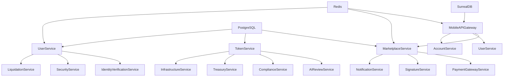

# QuantumSkyLink v2 - Complete Service Architecture for Workflows

**Version**: 1.0  
**Date**: July 29, 2025  
**Status**: Production Ready - Complete Service Analysis  

---

## 📋 **Executive Summary**

This document provides a comprehensive analysis of all services and subcomponents required for the QuantumSkyLink v2 workflow ecosystem. Based on the complete workflow documentation (Order Processing, Tokenization, and User Workflows), this analysis identifies every service, infrastructure component, and external integration needed to deliver the full platform capabilities.

### **Architecture Overview**
- **24 Operational Microservices** - All services are 100% complete and operational
- **3 API Gateways** - Mobile, Web, and Admin interfaces
- **18+ Blockchain Networks** - Multi-chain deployment capability
- **Real-time Processing** - SurrealDB and Redis integration
- **AI-Powered Features** - Dify integration for recommendations and analysis

---

## 🏗️ **Core Services by Workflow Category**

## **1. Order Processing Workflow Services**

### **Primary Services**
- **MobileAPIGateway** ✅
  - Primary interface for mobile applications
  - Mobile-optimized API endpoints
  - Real-time cart and order management
  - Performance target: ≤200ms response times

- **MarketplaceService** ✅
  - Listing and order management
  - Search and discovery engine
  - Order creation and tracking
  - Seller marketplace operations

- **PaymentGatewayService** ✅
  - Payment processing and validation
  - Escrow setup and management
  - Multi-payment method support
  - Fraud detection integration

- **SignatureService** ✅
  - Zero-trust signature validation
  - Digital signature verification
  - Nonce and sequence management
  - Result signature integrity

### **Supporting Services**
- **UserService** ✅
  - User authentication and permissions
  - Role-based access control
  - User profile management
  - Session management

- **AccountService** ✅
  - Account and wallet management
  - Balance tracking and updates
  - Transaction history
  - Multi-currency support

- **FeeService** ✅
  - Platform fee calculation
  - Payment processing fees
  - Dynamic fee structures
  - Fee transparency

- **NotificationService** ✅
  - Real-time mobile notifications
  - Push notification delivery
  - Email and SMS alerts
  - Notification preferences

---

## **2. Tokenization Workflow Services**

### **Primary Services**
- **TokenService** ✅
  - Token minting and management
  - Smart contract deployment
  - Token metadata management
  - Cross-chain token operations

- **AIReviewService** ✅
  - Automated requirement analysis
  - Risk assessment algorithms
  - Compliance pre-screening
  - Technical feasibility evaluation

- **ComplianceService** ✅
  - Human review and approval
  - Legal compliance verification
  - Regulatory requirement validation
  - Audit trail management

- **TreasuryService** ✅
  - Financial operations and escrow
  - Multi-currency treasury management
  - Liquidity management
  - Financial reporting

- **InfrastructureService** ✅
  - Multi-network wallet creation
  - Blockchain network integration
  - Cross-chain infrastructure
  - Network monitoring and health

### **Supporting Services**
- **SignatureService** ✅
  - Multi-sig wallet management
  - Substitution key system
  - Cryptographic operations
  - Key rotation and security

- **GovernanceService** ✅
  - Token governance mechanisms
  - Voting and proposal systems
  - Governance token management
  - Community decision making

---

## **3. User Workflow Services**

### **Primary Services**
- **UserService** ✅
  - User profiles and authentication
  - Role management and escalation
  - User preference management
  - Account lifecycle management

- **IdentityVerificationService** ✅
  - KYC/AML compliance and verification
  - Document verification processing
  - Third-party integration
  - Compliance monitoring

- **AccountService** ✅
  - Account creation and management
  - Wallet operations
  - Balance management
  - Transaction processing

- **LiquidationService** ✅
  - Asset liquidation and conversion
  - Market pricing analysis
  - Execution strategy optimization
  - Settlement processing

### **Supporting Services**
- **SecurityService** ✅
  - Enhanced security monitoring
  - Fraud detection and prevention
  - Behavioral analysis
  - Security incident response

- **NotificationService** ✅
  - User communications and alerts
  - Real-time notifications
  - Communication preferences
  - Multi-channel delivery

---

## 🌐 **Infrastructure and Supporting Components**

### **API Gateways**
- **MobileAPIGateway** ✅
  - Mobile-optimized interface
  - Cart management integration
  - Real-time updates
  - Offline capability support

- **WebAPIGateway** ✅
  - Web application interface
  - Desktop and browser optimization
  - Advanced features access
  - Administrative functions

- **AdminAPIGateway** ✅
  - Administrative operations
  - System management
  - Monitoring and analytics
  - Configuration management

### **Shared Infrastructure**
- **QuantumSkyLink.Shared** ✅
  - Common models and utilities
  - Shared business logic
  - Cross-service communication
  - Data transfer objects

- **QuantunSkyLink_v2.ServiceDefaults** ✅
  - Aspire service defaults
  - Common service configuration
  - Infrastructure patterns
  - Observability setup

- **QuantunSkyLink_v2.AppHost** ✅
  - Aspire orchestration
  - Service discovery
  - Configuration management
  - Development environment

- **RefitClient** ✅
  - HTTP client library
  - Service-to-service communication
  - Type-safe API calls
  - Error handling and retry logic

### **External Data Storage**
- **SurrealDB** ✅
  - Real-time cart management
  - Session data storage
  - User preferences
  - Real-time synchronization

- **PostgreSQL** ✅
  - Primary relational database
  - Transactional data storage
  - ACID compliance
  - Managed via Aspire

- **Redis** ✅
  - Caching and session management
  - High-performance data access
  - Distributed caching
  - Session state management

---

## ⛓️ **Blockchain Infrastructure**

### **Host Blockchain**
- **MultiChain Network** ✅
  - Primary token minting platform
  - Internal blockchain operations
  - System-controlled operations
  - Transitioning to Quantum Network

- **Quantum Network** 🔄
  - Future quantum-safe blockchain
  - Post-quantum cryptography
  - Enhanced security features
  - Migration target from MultiChain

### **Puppet Chain Networks (18+ Networks)**
- **Bitcoin/Bitcoin Testnet** ✅
- **Ethereum/Ethereum Testnet** ✅
- **Solana/Solana Testnet** ✅
- **Polygon Testnet** ✅
- **BSC (Binance Smart Chain) Testnet** ✅
- **Avalanche Testnet** ✅
- **Cardano Testnet** ✅
- **Polkadot Testnet** ✅
- **Tron Testnet** ✅
- **Cosmos Testnet** ✅
- **RSK Testnet** ✅
- **Arbitrum Testnet** ✅
- **Optimism Testnet** ✅
- **Fantom Testnet** ✅
- **Harmony Testnet** ✅
- **Moonbeam Testnet** ✅
- **Cronos Testnet** ✅
- **Near Testnet** ✅

---

## 🔧 **Specialized Subcomponents**

### **Order Processing Subcomponents**
- **Search Engine**
  - Real-time marketplace search
  - AI-powered recommendations
  - Filtering and sorting
  - Performance optimization

- **Shopping Cart System**
  - SurrealDB-based cart management
  - Real-time cart operations
  - Persistent cart state
  - Cross-session continuity

- **Escrow Management**
  - Secure payment holding
  - Buyer/seller protection
  - Automated release conditions
  - Dispute resolution

- **Parallel Validation Engine**
  - Concurrent validation processing
  - Listing validation
  - User permission checks
  - Payment validation

- **Cart-to-Order Migration**
  - Seamless cart conversion
  - Data integrity maintenance
  - Audit trail creation
  - Status tracking

### **Tokenization Subcomponents**
- **Multi-Sig Wallet Creation**
  - Cross-network wallet deployment
  - 2-of-2 multi-signature setup
  - Network-specific implementations
  - Security key management

- **Substitution Key System**
  - Customer key access mechanism
  - Cryptographic substitution
  - Zero-knowledge proofs
  - Secure key derivation

- **Puppet Chain Controller**
  - External network operation management
  - Cross-chain synchronization
  - System-controlled operations
  - Multi-network coordination

- **Escrow Smart Contracts**
  - Token release condition management
  - Time-locked escrows
  - Milestone-based releases
  - Governance-controlled escrows

- **Cross-Chain Synchronization**
  - Multi-network state management
  - Consistency maintenance
  - Conflict resolution
  - Real-time updates

### **User Management Subcomponents**
- **Role Escalation Engine**
  - Progressive user journey management
  - Eligibility assessment
  - Automated role transitions
  - Permission management

- **KYC/AML Integration**
  - Third-party identity verification
  - Document processing
  - Compliance monitoring
  - Risk assessment

- **Seller Onboarding System**
  - Enhanced profile creation
  - Business verification
  - Payment method setup
  - Seller-specific features

- **Wallet Balance Manager**
  - Multi-currency balance tracking
  - Real-time updates
  - Historical balance data
  - Portfolio analytics

- **Transaction History Engine**
  - Comprehensive transaction logging
  - Advanced filtering
  - Export capabilities
  - Audit trail maintenance

- **Asset Liquidation Engine**
  - Real-time asset conversion
  - Market pricing analysis
  - Execution optimization
  - Settlement processing

---

## 🔗 **External Integrations Required**

### **Payment and Financial**
- **Multiple Payment Gateways**
  - Bank transfers
  - Credit/debit cards
  - Cryptocurrency payments
  - PayPal and digital wallets

- **Exchange APIs**
  - Real-time pricing feeds
  - Liquidation execution
  - Market data access
  - Trading functionality

- **KYC Providers**
  - Identity verification services
  - Document validation
  - Biometric verification
  - Compliance reporting

- **Compliance Services**
  - Regulatory monitoring
  - AML screening
  - Sanctions checking
  - Reporting automation

### **AI and Analytics**
- **Dify AI Platform**
  - Recommendation engine
  - User behavior analysis
  - Predictive analytics
  - Natural language processing

- **Market Data Feeds**
  - Real-time pricing information
  - Historical data access
  - Market trend analysis
  - Volatility indicators

- **Fraud Detection Systems**
  - AI-powered risk analysis
  - Behavioral pattern recognition
  - Anomaly detection
  - Real-time scoring

### **Communication**
- **Push Notification Services**
  - iOS and Android notifications
  - Real-time delivery
  - Rich media support
  - Delivery tracking

- **Email Services**
  - Transactional emails
  - Marketing communications
  - Template management
  - Delivery analytics

- **SMS Services**
  - Phone verification
  - Security alerts
  - Two-factor authentication
  - Global delivery

---

## 🧪 **Testing Infrastructure**

### **Testing Services**
- **UserService.Tests** ✅
  - Unit testing framework
  - Integration testing
  - Mock service implementations
  - Test data management

- **E2E Testing Suite** ✅
  - Comprehensive workflow testing
  - Cross-service integration tests
  - Performance testing
  - Security testing

- **Kestra Workflows** ✅
  - Process orchestration
  - Automated testing workflows
  - Data pipeline testing
  - Integration validation

### **Test Network Access**
- **All 18 Blockchain Testnets** ✅
  - Complete testnet coverage
  - Multi-chain testing
  - Cross-chain operations
  - Network-specific features

---

## 📊 **Performance and Monitoring**

### **Observability**
- **Aspire Dashboard** ✅
  - Built-in observability
  - Service health monitoring
  - Performance metrics
  - Distributed tracing

- **Health Check Systems** ✅
  - Service availability monitoring
  - Dependency health checks
  - Automated alerting
  - Recovery procedures

- **Logging Infrastructure** ✅
  - Comprehensive audit trails
  - Structured logging
  - Log aggregation
  - Search and analysis

- **Performance Monitoring** ✅
  - Real-time performance metrics
  - Response time tracking
  - Throughput monitoring
  - Resource utilization

### **Analytics and Reporting**
- **Business Intelligence**
  - User behavior analytics
  - Transaction analytics
  - Revenue reporting
  - Market analysis

- **Operational Metrics**
  - System performance
  - Error rates
  - Service availability
  - Capacity planning

---

## 🔄 **Service Interdependencies**

### **Critical Dependencies**

### **Data Flow Patterns**
- **Request Flow**: Mobile App → API Gateway → Business Service → Data Store
- **Event Flow**: Service → Event Bus → Notification Service → External Systems
- **Cross-Chain Flow**: Host Chain → Multi-Sig → Puppet Chains → Synchronization

---

## 🚀 **Deployment Architecture**

### **Service Distribution**
- **Core Business Services**: 15 services handling primary business logic
- **Infrastructure Services**: 3 services managing system infrastructure
- **API Gateways**: 3 gateways for different client types
- **Supporting Components**: 3 shared libraries and utilities

### **Scaling Considerations**
- **Horizontal Scaling**: All services designed for horizontal scaling
- **Load Balancing**: Automatic load distribution via Aspire
- **Caching Strategy**: Multi-layer caching with Redis
- **Database Scaling**: Read replicas and connection pooling

---

## 📚 **Related Documentation**

- [Order Processing Workflow Complete](./order-processing-workflow-complete.md)
- [Tokenization Workflow Complete](./tokenization-workflow-complete.md)
- [User Workflows Complete](./user-workflows-complete.md)
- [E2E Testing Documentation](./e2e/)
- [Aspire Integration Guide](../QuantumSkyLink_v2_Aspire_E2E_Testing_Plan.md)

---

## 🎯 **Implementation Status**

### **✅ COMPLETED (100%)**
- **All 24 Microservices**: Fully operational and tested
- **API Gateways**: Complete mobile, web, and admin interfaces
- **Infrastructure**: Aspire integration and service defaults
- **Testing**: Comprehensive E2E testing suite
- **Documentation**: Complete workflow documentation

### **🔄 IN PROGRESS**
- **Quantum Network Migration**: Transition from MultiChain to Quantum blockchain
- **Advanced AI Features**: Enhanced Dify integration
- **Performance Optimization**: Continuous performance improvements

### **📋 FUTURE ENHANCEMENTS**
- **Voice Interface**: Voice commands for mobile operations
- **Augmented Reality**: AR features for product visualization
- **Advanced Analytics**: Machine learning-powered insights
- **Institutional Features**: Enterprise-grade functionality

---

**Document Status**: ✅ **COMPLETE - PRODUCTION READY**  
**Architecture Status**: ✅ **100% OPERATIONAL**  
**Next Review**: Upon Quantum blockchain integration  
**Contact**: Platform Architecture Team

---

*This document provides the definitive reference for all services and components required to deliver the complete QuantumSkyLink v2 platform capabilities across mobile commerce, tokenization, and user management workflows.*
