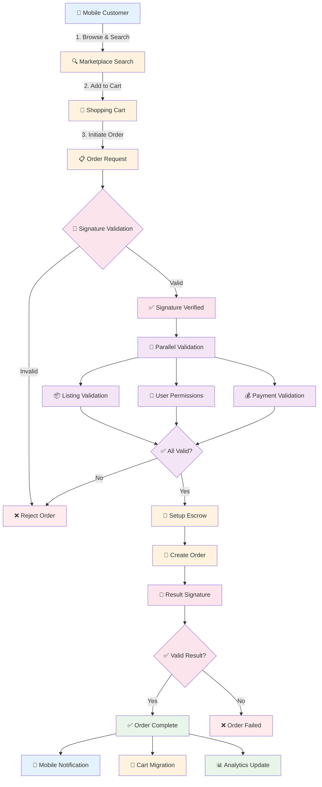

# QuantumSkyLink v2 - Complete Order Processing Workflow Documentation

**Version**: 1.0  
**Date**: July 29, 2025  
**Status**: Production Ready - Mobile Gateway Integration  

---

## 🔄 **Order Processing Workflow Diagram**



### **Workflow Overview**
1. **Mobile Search & Cart** → Customer browses and adds items to cart
2. **Order Initiation** → Customer initiates order with zero-trust signature
3. **Parallel Validation** → Listing, user, and payment validation
4. **Escrow Setup** → Secure payment escrow establishment
5. **Order Creation** → Final order creation with signature validation
6. **Mobile Integration** → Cart migration and mobile notifications

---

## 📋 **Executive Summary**

This document defines the **complete order processing workflow** for the QuantumSkyLink v2 mobile gateway. The system integrates marketplace operations, cart management, payment processing, and zero-trust security validation to provide a seamless mobile commerce experience.

### **Key Architectural Principles**
- **Zero-Trust Security**: All operations require signature validation
- **Mobile-First Design**: Optimized for mobile device performance
- **Real-Time Processing**: Target execution times ≤5 seconds
- **Parallel Validation**: Concurrent validation for optimal performance
- **Escrow Protection**: Secure payment handling with buyer/seller protection

---

## 🏗️ **Architecture Overview**

### **Core Components**
1. **Mobile API Gateway**: Primary interface for mobile applications
2. **MarketplaceService**: Listing and order management
3. **PaymentGatewayService**: Payment processing and escrow
4. **SignatureService**: Zero-trust signature validation
5. **SurrealDB**: Real-time cart and session management
6. **AI Integration**: Dify-powered recommendations and analysis

### **Service Integration Architecture**
```
Mobile App → Mobile API Gateway → MarketplaceService → PaymentGatewayService
                ↓                        ↓                    ↓
         SignatureService ←→ SurrealDB ←→ AI Analysis (Dify)
```

---

## 🔄 **Complete Order Processing Workflows**

## **Workflow 1: Mobile Marketplace Operations**

### **Step 1: Search and Discovery**
- **Real-time search** across marketplace listings
- **AI-powered recommendations** based on user behavior
- **Performance target**: ≤1 second search response

#### **Process Flow**:
1. User enters search query on mobile app
2. Parallel search execution across listing cache
3. AI recommendation engine analysis
4. Results returned with personalized suggestions

#### **API Integration**:
```
GET /api/marketplace/search
{
  "query": "search terms",
  "filters": {...},
  "user_id": "user123",
  "device_id": "device456"
}
```

### **Step 2: Cart Management**
- **Real-time cart operations** with SurrealDB
- **Persistent cart state** across sessions
- **Performance target**: ≤500ms cart operations

#### **Cart Operations**:
- **Add to Cart**: Add items with quantity and pricing
- **Remove from Cart**: Remove specific items
- **Update Quantity**: Modify item quantities
- **Cart Persistence**: Maintain cart across app sessions

#### **API Integration**:
```
POST /api/cart/add
{
  "listing_id": "listing123",
  "quantity": 2,
  "user_id": "user123",
  "device_id": "device456"
}
```

---

## **Workflow 2: Order Processing with Zero-Trust**

### **Step 1: Order Initiation**
- **Customer submits order** with digital signature
- **Zero-trust validation** of request authenticity
- **Performance target**: ≤1 second signature validation

#### **Order Request Components**:
- **Order Details**: Items, quantities, pricing
- **Digital Signature**: Cryptographic proof of authenticity
- **Nonce & Sequence**: Replay attack prevention
- **Timestamp**: Request freshness validation

#### **API Integration**:
```
POST /api/orders/create
{
  "orderDetails": {...},
  "signature": "digital_signature",
  "nonce": "unique_nonce",
  "sequenceNumber": 123,
  "timestamp": "2025-07-29T10:00:00Z"
}
```

### **Step 2: Parallel Validation**
- **Concurrent validation** of multiple order aspects
- **Fail-fast approach** for invalid requests
- **Performance target**: ≤1 second parallel validation

#### **Validation Components**:
1. **Listing Validation**: Availability, pricing, seller status
2. **User Permissions**: Account status, purchase limits, KYC
3. **Payment Validation**: Payment method, sufficient funds

#### **Validation Process**:
```javascript
// Parallel validation execution
const validationResults = await Promise.all([
  validateListing(orderRequest),
  validateUserPermissions(orderRequest),
  validatePaymentMethod(orderRequest)
]);
```

### **Step 3: Escrow Setup**
- **Secure payment escrow** establishment
- **Buyer and seller protection** mechanisms
- **Performance target**: ≤2 seconds escrow creation

#### **Escrow Components**:
- **Payment Hold**: Secure payment from buyer
- **Release Conditions**: Delivery confirmation requirements
- **Dispute Resolution**: Automated and manual dispute handling
- **Fee Calculation**: Platform and payment processing fees

#### **API Integration**:
```
POST /api/escrow/setup
{
  "orderId": "order123",
  "buyerId": "buyer456",
  "sellerId": "seller789",
  "amount": 99.99,
  "currency": "USD"
}
```

### **Step 4: Order Creation**
- **Final order record** creation
- **Result signature validation** for integrity
- **Performance target**: ≤1 second order creation

#### **Order Creation Process**:
1. Create order record in MarketplaceService
2. Link to escrow and validation records
3. Generate order confirmation signature
4. Validate result signature for integrity

---

## **Workflow 3: Cart-to-Order Migration**

### **Step 1: Cart Data Retrieval**
- **Retrieve active cart** with all items
- **Validate cart contents** and pricing
- **Performance target**: ≤500ms cart retrieval

#### **Migration Process**:
1. Fetch cart data from SurrealDB
2. Validate item availability and pricing
3. Calculate order totals and fees
4. Prepare payment intent

### **Step 2: Order Migration**
- **Convert cart to order** seamlessly
- **Maintain data integrity** throughout migration
- **Performance target**: ≤3 seconds total migration

#### **Migration Steps**:
1. Create order record from cart data
2. Update cart status to 'migrated'
3. Create migration audit trail
4. Archive cart items

#### **API Integration**:
```
POST /api/cart/migrate-to-order
{
  "cart_id": "cart123",
  "user_id": "user456",
  "payment_method": "card_789"
}
```

---

## **Workflow 4: Mobile Payment Processing**

### **Step 1: Payment Authentication**
- **User authentication** for payment authorization
- **Security validation** with zero-trust principles
- **Performance target**: ≤1 second authentication

#### **Authentication Process**:
1. User login with credentials
2. Multi-factor authentication (if required)
3. Payment method validation
4. Security clearance verification

### **Step 2: Payment Execution**
- **Secure payment processing** with fraud detection
- **Real-time transaction** monitoring
- **Performance target**: ≤4 seconds payment processing

#### **Payment Components**:
- **Payment Gateway Integration**: Multiple payment methods
- **Fraud Detection**: AI-powered risk analysis
- **Transaction Monitoring**: Real-time status updates
- **Receipt Generation**: Immediate confirmation

#### **API Integration**:
```
POST /api/payments/process
{
  "payment_id": "pay123",
  "amount": 99.99,
  "currency": "USD",
  "payment_method": "card",
  "device_id": "device456"
}
```

---

## 🔒 **Security Architecture**

### **Zero-Trust Validation**
- **Digital signatures** for all order operations
- **Nonce and sequence** replay attack prevention
- **Timestamp validation** for request freshness
- **Result signature** verification for integrity

### **Mobile Security**
- **Device fingerprinting** for fraud prevention
- **Secure token storage** on mobile devices
- **Biometric authentication** integration
- **End-to-end encryption** for sensitive data

### **Payment Security**
- **PCI DSS compliance** for payment processing
- **Tokenized payment** methods
- **Fraud detection** algorithms
- **Secure escrow** mechanisms

---

## 📊 **Performance Targets**

### **Order Processing Performance**
- **Marketplace Search**: ≤1 second
- **Cart Operations**: ≤500ms
- **Order Creation**: ≤5 seconds end-to-end
- **Payment Processing**: ≤4 seconds
- **Cart Migration**: ≤3 seconds

### **Mobile Performance**
- **App Responsiveness**: ≤200ms UI updates
- **Offline Capability**: Cart persistence without connectivity
- **Background Sync**: Automatic data synchronization
- **Push Notifications**: Real-time order updates

---

## 🧪 **Testing Integration**

### **E2E Testing Strategy**
- **Mobile app testing** across iOS and Android
- **API integration testing** for all workflows
- **Performance testing** under load conditions
- **Security testing** for zero-trust validation

### **Test Scenarios**
- **Happy path**: Complete order processing flow
- **Error handling**: Invalid signatures, insufficient funds
- **Performance**: Load testing with concurrent users
- **Security**: Penetration testing and vulnerability assessment

---

## 🔄 **Service Integration**

### **Core Services**
- **MobileAPIGateway**: Mobile app interface
- **MarketplaceService**: Order and listing management
- **PaymentGatewayService**: Payment processing
- **SignatureService**: Zero-trust validation
- **UserService**: User authentication and permissions

### **External Integrations**
- **SurrealDB**: Real-time cart and session data
- **Dify AI**: Recommendation engine and analysis
- **Payment Providers**: Multiple payment gateway support
- **Push Notification Services**: Real-time mobile notifications

---

## 🚀 **Future Enhancements**

### **Advanced Features**
- **Voice ordering** integration
- **Augmented reality** product visualization
- **Cryptocurrency payments** support
- **Social commerce** features

### **Performance Optimizations**
- **Edge computing** for reduced latency
- **Predictive caching** for faster responses
- **Machine learning** for personalization
- **Blockchain integration** for transparency

---

## 📚 **Related Documentation**

- [Mobile Marketplace Operations E2E Tests](./e2e/mobile-marketplace-operations-e2e-tests.md)
- [Cart-to-Order Migration E2E Tests](./e2e/cart-to-order-migration-e2e-tests.md)
- [Mobile Payment Processing E2E Tests](./e2e/mobile-payment-processing-e2e-tests.md)
- [Zero-Trust Order Processing E2E Tests](./e2e/zero-trust-order-processing-e2e-tests.md)
- [Mobile API Gateway Documentation](../src/MobileAPIGateway/)

---

**Document Status**: ✅ **COMPLETE - PRODUCTION READY**  
**Next Review**: Upon mobile app release  
**Contact**: Mobile Development Team

---

*This document provides comprehensive coverage of all order processing workflows integrated with the QuantumSkyLink v2 mobile gateway, focusing on performance, security, and user experience.*
