# QuantumSkyLink v2 - Complete Tokenization Workflow Documentation

**Version**: 2.0  
**Date**: July 29, 2025  
**Status**: Corrected Architecture - Production Ready

---

## 🔄 **Tokenization Workflow Diagram**

```mermaid
flowchart TD
    %% Customer Input
    A[👤 Customer] -->|1. Submit Requirements + Deposit| B[📋 Requirements Form]
    
    %% Requirements Processing
    B --> C{🤖 AI Review}
    C -->|Pass| D{👨‍💼 Admin Review}
    C -->|Fail| E[❌ Rejection + Refund]
    D -->|Approve| F[✅ Approved]
    D -->|Reject| E
    
    %% Token Creation
    F --> G[🏭 Token Minting]
    G --> H[🔗 Host Chain<br/>MultiChain/Quantum]
    
    %% Multi-Sig Deployment
    H --> I[🔐 Multi-Sig Wallet Creation]
    I --> J[🌐 Target Networks]
    
    %% Network Deployment
    J --> K1[₿ Bitcoin Testnet]
    J --> K2[⟠ Ethereum Testnet]
    J --> K3[◎ Solana Testnet]
    J --> K4[🔷 Polygon Testnet]
    J --> K5[🟡 BSC Testnet]
    J --> K6[🔺 Avalanche Testnet]
    J --> K7[... 12 More Networks]
    
    %% Escrow Management
    I --> L[🏦 Escrow System]
    L --> M[📝 Release Conditions]
    
    %% Operations
    M --> N[⚙️ Puppet Chain Operations]
    N --> O[🔄 System-Controlled Ops]
    O --> P[🔑 Multi-Sig Required]
    
    %% Key Management
    I --> Q[🗝️ Substitution Keys]
    Q --> R[🏢 System Keys]
    Q --> S[👤 Customer Keys]
    
    %% Styling
    classDef customer fill:#e1f5fe
    classDef process fill:#f3e5f5
    classDef approval fill:#e8f5e8
    classDef rejection fill:#ffebee
    classDef blockchain fill:#fff3e0
    classDef security fill:#fce4ec
    
    class A customer
    class B,C,D process
    class F approval
    class E rejection
    class G,H,J,K1,K2,K3,K4,K5,K6,K7 blockchain
    class I,L,N,O,P,Q,R,S security
```



### **Workflow Overview**
1. **Requirements Submission** → Customer submits token specs + deposit
2. **AI/Admin Review** → Automated analysis + human validation
3. **Token Minting** → Creation on host chain (MultiChain/Quantum)
4. **Multi-Sig Deployment** → Wallet creation across 18 networks
5. **Escrow Management** → Token placement with release conditions
6. **Puppet Operations** → System-controlled cross-chain operations

---

## 📋 **Executive Summary**

This document defines the **complete tokenization workflow** for the QuantumSkyLink v2 platform. Unlike simple asset conversion, this is a sophisticated **token creation and multi-chain deployment system** that involves customer requirements, AI/admin review, token minting, multi-signature wallet creation, and system-controlled operations across 18+ blockchain networks.

### **Key Architectural Principles**
- **Token Creation**: New tokens are minted, not converted from existing assets
- **Multi-Chain Deployment**: Tokens deployed across multiple networks via multi-sig wallets
- **System Control**: All formal operations require system signatures
- **Escrow Management**: Tokens held in escrow on internal blockchain
- **Puppet Chain Operations**: External networks controlled via system-initiated operations

---

## 🏗️ **Architecture Overview**

### **Core Components**
1. **Host Chain**: MultiChain (transitioning to Quantum blockchain)
2. **Puppet Chains**: External networks (Bitcoin, Ethereum, Solana, etc.) controlled via multi-sig
3. **Multi-Sig Wallets**: System + customer key pairs with substitution key access
4. **Escrow System**: Internal blockchain token management
5. **AI/Admin Review**: Automated and human validation processes

### **Network Architecture**
```
Customer Requirements → AI/Admin Review → Host Chain Minting → Multi-Sig Deployment → Escrow Management
                                              ↓
                                    Puppet Chain Operations
                                    (Bitcoin, Ethereum, Solana, etc.)
```

---

## 🔄 **Complete Tokenization Workflow**

### **Step 1: Customer Requirements Submission**

#### **Process**
- **Customer fills out comprehensive token requirements**
- **Required deposit** submitted alongside requirements
- **Specifications include**: tokenomics, use case, distribution model, target networks

#### **Requirements Form Components**
- **Token Specifications**:
  - Token name and symbol
  - Total supply and distribution model
  - Utility and use case description
  - Target blockchain networks for deployment

- **Technical Requirements**:
  - Smart contract features needed
  - Multi-sig configuration preferences
  - Governance model (if applicable)
  - Compliance requirements

- **Financial Components**:
  - Initial deposit amount
  - Fee structure acceptance
  - Revenue sharing model (if applicable)
  - Escrow terms agreement

#### **API Integration**
```
POST /api/tokens/requirements/submit
{
  "customerInfo": {...},
  "tokenSpecs": {...},
  "technicalReqs": {...},
  "depositInfo": {...},
  "targetNetworks": ["ETHEREUM", "POLYGON", "BSC", ...]
}
```

### **Step 2: AI and Internal Admin Review**

#### **AI Review Process (AIReviewService)**
- **Automated analysis** of token requirements
- **Risk assessment** based on predefined criteria
- **Compliance pre-screening** for regulatory requirements
- **Technical feasibility** evaluation
- **Market analysis** and competitive assessment

#### **Internal Admin Review (ComplianceService)**
- **Human validation** of AI recommendations
- **Legal compliance** verification
- **Business case** evaluation
- **Final approval/rejection** decision
- **Feedback provision** for rejected applications

#### **Review Criteria**
- **Technical Viability**: Can the requirements be implemented?
- **Regulatory Compliance**: Does it meet all legal requirements?
- **Business Value**: Does it align with platform objectives?
- **Risk Assessment**: What are the potential risks and mitigations?
- **Resource Requirements**: What resources are needed for implementation?

#### **API Integration**
```
GET /api/tokens/requirements/{id}/review-status
{
  "status": "UNDER_REVIEW" | "APPROVED" | "REJECTED",
  "aiReviewScore": 85,
  "adminComments": "...",
  "approvalDate": "2025-01-29T10:00:00Z"
}
```

### **Step 3: Token Minting (Upon Approval)**

#### **Host Chain Minting**
- **Tokens are first minted internally** on the **MultiChain blockchain network**
- **Future transition** to **Quantum blockchain** for quantum-safe operations
- **Initial token supply** created according to approved specifications
- **Token metadata** and smart contract deployed

#### **Minting Process**
1. **Smart contract deployment** on host chain (MultiChain/Quantum)
2. **Initial token supply** minted to system-controlled address
3. **Token metadata** registered (name, symbol, decimals, etc.)
4. **Audit trail** created for compliance tracking
5. **Token ID** assigned for cross-system tracking

#### **TokenService Integration**
```
POST /api/tokens/mint
{
  "requirementId": "req_123",
  "tokenSpecs": {...},
  "initialSupply": 1000000,
  "hostChain": "MULTICHAIN"
}
```

### **Step 4: Multi-Sig Wallet Creation**

#### **Multi-Sig Architecture**
- **Every account is a basic multi-sig wallet**
- **System owns one set of keys** (for security and control)
- **Customer has access through substitution key process**
- **Wallets created on respective networks** according to token requirements

#### **Substitution Key Process**
- **Customer keys** are managed through secure substitution mechanism
- **System maintains master keys** for all operations
- **Customer access** provided through cryptographic substitution
- **Security model**: Customer can initiate, system must approve and execute

#### **Network Deployment**
Multi-sig wallets created across target networks:
- **Bitcoin/Bitcoin Testnet**: P2SH multi-sig addresses
- **Ethereum/EVM Networks**: Multi-sig smart contracts
- **Solana**: Multi-sig program accounts
- **Other Networks**: Network-specific multi-sig implementations

#### **Wallet Creation Process**
1. **Generate key pairs** for system and customer
2. **Create multi-sig wallets** on each target network
3. **Deploy smart contracts** (for EVM networks)
4. **Register wallet addresses** in system database
5. **Establish substitution key** relationships
6. **Test wallet functionality** across all networks

#### **API Integration**
```
POST /api/tokens/{tokenId}/wallets/create
{
  "networks": ["ETHEREUM", "POLYGON", "BSC"],
  "multiSigConfig": {
    "requiredSignatures": 2,
    "totalSigners": 2
  }
}
```

### **Step 5: Escrow Management**

#### **Escrow System**
- **Tokens put in escrow** on internal blockchain if not the intended host chain
- **Escrow smart contracts** manage token distribution and access
- **Release conditions** defined based on customer requirements
- **Multi-signature approval** required for escrow operations

#### **Escrow Types**
- **Time-locked Escrow**: Tokens released based on time schedules
- **Milestone Escrow**: Tokens released upon achievement of specific milestones
- **Governance Escrow**: Tokens released through governance voting
- **Performance Escrow**: Tokens released based on performance metrics

#### **Escrow Operations**
1. **Escrow creation** with defined release conditions
2. **Token deposit** into escrow smart contract
3. **Condition monitoring** and validation
4. **Release execution** when conditions are met
5. **Audit logging** for all escrow activities

#### **API Integration**
```
POST /api/tokens/{tokenId}/escrow/create
{
  "escrowType": "TIME_LOCKED",
  "releaseConditions": {...},
  "tokenAmount": 500000,
  "beneficiary": "customer_wallet_address"
}
```

### **Step 6: Puppet Chain Operations**

#### **System-Controlled Operations**
- **All formal activities** must be initiated from our system
- **Multi-signature approval** required from all parties
- **System performs actions** on either:
  - **Host chain** (MultiChain/Quantum)
  - **Puppet chains** (external networks under system control)

#### **Puppet Chain Architecture**
- **External networks** (Bitcoin, Ethereum, Solana, etc.) controlled via multi-sig wallets
- **System maintains control keys** for all puppet chain operations
- **Customer operations** require system approval and execution
- **Cross-chain synchronization** maintained across all networks

#### **Operation Types**
- **Token Transfers**: Moving tokens between addresses
- **Smart Contract Interactions**: Executing contract functions
- **Cross-Chain Bridges**: Moving tokens between networks
- **Governance Actions**: Voting and proposal execution
- **Liquidity Operations**: Adding/removing liquidity

#### **Execution Process**
1. **Operation request** submitted by customer or system
2. **Multi-signature collection** from all required parties
3. **System validation** of operation parameters
4. **Execution on target network** (host or puppet chain)
5. **Cross-chain synchronization** if applicable
6. **Confirmation and logging** of completed operation

#### **API Integration**
```
POST /api/tokens/{tokenId}/operations/execute
{
  "operationType": "TRANSFER",
  "targetNetwork": "ETHEREUM",
  "parameters": {...},
  "signatures": [...]
}
```

---

## 🔒 **Security Architecture**

### **Multi-Signature Security**
- **2-of-2 multi-sig** standard configuration
- **System key**: Held securely by platform
- **Customer key**: Accessed via substitution key process
- **Hardware security modules** for key storage
- **Regular key rotation** procedures

### **Substitution Key Process**
- **Cryptographic substitution** mechanism for customer key access
- **Zero-knowledge proofs** for key validation
- **Secure key derivation** from customer credentials
- **Audit trail** for all key operations
- **Emergency recovery** procedures

### **Access Control**
- **Role-based permissions** for different operation types
- **Time-locked operations** for high-value transactions
- **Geographic restrictions** for sensitive operations
- **Multi-factor authentication** for all access

---

## 🧪 **Testing Integration**

### **E2E Testing Strategy**
- **Requirements submission** testing through mobile gateway
- **AI/Admin review** simulation and validation
- **Token minting** verification on host chain
- **Multi-sig wallet creation** across all 18 networks
- **Escrow management** testing and validation
- **Puppet chain operations** comprehensive testing

### **Test Networks**
All testing performed on testnets:
- **BITCOIN_TESTNET**, **ETHEREUM_TESTNET**, **SOLANA_TESTNET**
- **POLYGON_TESTNET**, **BSC_TESTNET**, **AVALANCHE_TESTNET**
- **CARDANO_TESTNET**, **POLKADOT_TESTNET**, **TRON_TESTNET**
- **COSMOS_TESTNET**, **RSK_TESTNET**, **QUANTUM_TESTNET**

---

## 📊 **Performance Targets**

### **Workflow Performance**
- **Requirements Submission**: ≤5 seconds
- **AI Review**: ≤30 seconds
- **Admin Review**: ≤24 hours (human process)
- **Token Minting**: ≤10 seconds
- **Multi-Sig Creation**: ≤60 seconds per network
- **Escrow Setup**: ≤15 seconds
- **Puppet Chain Operations**: ≤30 seconds

### **System Performance**
- **Multi-Sig Operations**: ≤10 seconds
- **Cross-Chain Sync**: ≤60 seconds
- **Escrow Releases**: ≤30 seconds
- **Substitution Key Access**: ≤5 seconds

---

## 🔄 **Service Integration**

### **Core Services**
- **TokenService**: Token minting and management
- **AIReviewService**: Automated requirement analysis
- **ComplianceService**: Human review and approval
- **TreasuryService**: Financial operations and escrow
- **InfrastructureService**: Multi-network wallet creation
- **SignatureService**: Multi-sig and substitution key management

### **External Integrations**
- **MultiChain Network**: Host blockchain for token minting
- **Quantum Network**: Future host blockchain (quantum-safe)
- **18 Blockchain Networks**: Puppet chain deployments
- **Mobile API Gateway**: Customer interface
- **Kestra Workflows**: Process orchestration

---

## 🚀 **Future Enhancements**

### **Quantum Transition**
- **Migration from MultiChain** to Quantum blockchain
- **Quantum-safe cryptography** implementation
- **Post-quantum multi-sig** algorithms
- **Quantum-resistant substitution keys**

### **Advanced Features**
- **Automated governance** token deployment
- **Cross-chain DeFi** integration
- **Institutional custody** solutions
- **Regulatory compliance** automation

---

## 📚 **Related Documentation**

- [Multi-Network Service Implementation](../src/InfrastructureService/Services/MultiNetworkService.cs)
- [E2E Testing Specifications](./e2e/tokenization-workflow-e2e-tests.md)
- [Substitution Key Architecture](./substitution-key-process.md) *(To be created)*
- [Multi-Sig Wallet Management](./multi-sig-wallet-system.md) *(To be created)*
- [Escrow System Documentation](./escrow-management-system.md) *(To be created)*

---

**Document Status**: ✅ **COMPLETE - CORRECTED ARCHITECTURE**  
**Next Review**: Upon Quantum blockchain integration  
**Contact**: Tokenization Development Team

---

*This document reflects the corrected understanding of the QuantumSkyLink v2 tokenization workflow as a sophisticated token creation and multi-chain deployment system, not a simple asset conversion process.*
