# QuantumSkyLink v2 - Complete User Workflows Documentation

**Version**: 1.0  
**Date**: July 29, 2025  
**Status**: Production Ready - Mobile Gateway Integration  

---

## 🔄 **User Workflows Diagram**

```mermaid
flowchart TD
    %% User Registration and Onboarding
    A[📱 New User] -->|1. Registration| B[📋 User Onboarding]
    B --> C{✅ KYC Required?}
    C -->|Yes| D[🔍 Identity Verification]
    C -->|No| E[👤 Basic User Profile]
    D --> F[✅ Verified User]
    E --> G[🔄 Role Escalation Available]
    F --> G
    
    %% Role Escalation Path
    G --> H{🎯 Role Upgrade?}
    H -->|Seller| I[🏪 Seller Onboarding]
    H -->|Provider| J[💰 Liquidity Provider]
    H -->|Stay Basic| K[👤 Basic User Features]
    
    %% Seller Onboarding
    I --> L[📝 Seller Profile Creation]
    L --> M[🔐 Enhanced Security Setup]
    M --> N[💳 Payment Methods Setup]
    N --> O[✅ Seller Account Active]
    
    %% Wallet Management
    K --> P[💼 Wallet Management]
    O --> P
    J --> P
    P --> Q[💰 Balance Checking]
    P --> R[📊 Transaction History]
    P --> S[🔄 Transfers & Payments]
    
    %% Liquidation Process
    P --> T{💱 Liquidation Needed?}
    T -->|Yes| U[📋 Liquidation Request]
    T -->|No| V[💼 Continue Wallet Ops]
    U --> W[🔍 Asset Eligibility Check]
    W --> X[💲 Market Pricing Analysis]
    X --> Y[🏦 Liquidation Processing]
    Y --> Z[✅ Funds Available]
    
    %% Styling
    classDef user fill:#e3f2fd
    classDef onboarding fill:#f3e5f5
    classDef seller fill:#e8f5e8
    classDef wallet fill:#fff3e0
    classDef liquidation fill:#ffebee
    classDef process fill:#fce4ec
    
    class A,K user
    class B,C,D,E,F,G onboarding
    class H,I,L,M,N,O seller
    class P,Q,R,S,V wallet
    class T,U,W,X,Y,Z liquidation
    class J process
```



### **Workflow Overview**
1. **User Onboarding** → Registration, KYC verification, profile creation
2. **Role Escalation** → Upgrade to seller or liquidity provider roles
3. **Seller Onboarding** → Enhanced profile, security, payment setup
4. **Wallet Management** → Balance checking, transactions, transfers
5. **Liquidation Process** → Asset conversion to cash/stable currencies

---

## 📋 **Executive Summary**

This document defines the **complete user workflow ecosystem** for the QuantumSkyLink v2 platform. It covers the entire user journey from initial registration through advanced features like seller onboarding, wallet management, and asset liquidation, all optimized for mobile gateway integration.

### **Key Architectural Principles**
- **Progressive User Journey**: Seamless progression from basic to advanced features
- **Mobile-First Experience**: All workflows optimized for mobile devices
- **Security-First Design**: Enhanced security at each escalation level
- **Real-Time Operations**: Instant wallet updates and transaction processing
- **Compliance Integration**: KYC/AML compliance throughout user journey

---

## 🏗️ **Architecture Overview**

### **Core Components**
1. **UserService**: User profiles, authentication, role management
2. **IdentityVerificationService**: KYC/AML compliance and verification
3. **AccountService**: Account creation and management
4. **LiquidationService**: Asset liquidation and conversion
5. **Mobile API Gateway**: Mobile-optimized user interface
6. **SurrealDB**: Real-time user session and preference management

### **Service Integration Architecture**
```
Mobile App → Mobile API Gateway → UserService → IdentityVerificationService
                ↓                      ↓              ↓
         AccountService ←→ LiquidationService ←→ SurrealDB
```

---

## 🔄 **Complete User Workflows**

## **Workflow 1: User Onboarding Process**

### **Step 1: Initial Registration**
- **Mobile app registration** with basic information
- **Email and phone verification** for account security
- **Performance target**: ≤8 seconds end-to-end onboarding

#### **Registration Components**:
- **Personal Information**: Name, email, phone, country
- **Security Setup**: Password, optional biometric authentication
- **Device Registration**: Mobile device fingerprinting
- **Initial Preferences**: Notification settings, language, timezone

#### **API Integration**:
```
POST /api/auth/register
{
  "email": "user@example.com",
  "password": "secure_password",
  "firstName": "John",
  "lastName": "Doe",
  "phoneNumber": "+1234567890",
  "country": "US",
  "deviceId": "mobile_device_123"
}
```

### **Step 2: Conditional KYC Verification**
- **Risk-based KYC** determination based on user profile
- **Document upload** and verification process
- **Identity verification** through third-party providers

#### **KYC Process Flow**:
1. **Risk Assessment**: Automated evaluation of KYC requirements
2. **Document Collection**: Passport, driver's license, or national ID
3. **Verification Processing**: Third-party identity verification
4. **Compliance Approval**: Final approval for account activation

#### **API Integration**:
```
POST /api/kyc/initiate
{
  "userId": "user_123",
  "verificationType": "STANDARD_KYC",
  "documentTypes": ["PASSPORT", "DRIVERS_LICENSE"],
  "country": "US"
}
```

### **Step 3: Account Activation**
- **Account setup** with initial permissions
- **Welcome notifications** and onboarding guidance
- **Initial role assignment** (Basic User)

---

## **Workflow 2: Role Escalation and Seller Onboarding**

### **Step 1: Role Escalation Request**
- **User-initiated upgrade** to seller or provider roles
- **Eligibility assessment** based on account history
- **Enhanced verification** requirements for elevated roles

#### **Available Role Progressions**:
- **Basic User** → **Market Seller**: Ability to list and sell items
- **Basic User** → **Liquidity Provider**: Provide liquidity for trading
- **Market Seller** → **Verified Seller**: Enhanced seller privileges
- **Any Role** → **Premium User**: Advanced platform features

#### **API Integration**:
```
POST /api/users/role-escalation
{
  "userId": "user_123",
  "targetRole": "MARKET_SELLER",
  "businessInfo": {
    "businessName": "Crypto Trading Co",
    "businessType": "Individual",
    "tradingExperience": "5+ years"
  }
}
```

### **Step 2: Seller Profile Creation**
- **Enhanced profile setup** with business information
- **Seller verification** process and documentation
- **Performance target**: ≤10 seconds profile creation

#### **Seller Profile Components**:
- **Business Information**: Company name, type, experience level
- **Trading Preferences**: Supported currencies, payment methods
- **Verification Documents**: Business license, tax information
- **Seller Policies**: Return policy, shipping terms, dispute resolution

#### **API Integration**:
```
POST /api/sellers/profile
{
  "userId": "user_123",
  "businessName": "Crypto Trading Co",
  "description": "Reliable cryptocurrency seller with 5+ years experience",
  "paymentMethods": ["bank_transfer", "crypto", "paypal"],
  "supportedCurrencies": ["USD", "EUR", "BTC", "ETH"],
  "verificationDocuments": ["business_license.pdf", "tax_id.pdf"]
}
```

### **Step 3: Enhanced Security Setup**
- **Multi-factor authentication** mandatory for sellers
- **Advanced security features** and monitoring
- **Seller-specific permissions** and access controls

---

## **Workflow 3: Wallet Management and Balance Operations**

### **Step 1: Wallet Balance Checking**
- **Real-time balance** across multiple currencies
- **Multi-currency support** with live exchange rates
- **Performance target**: ≤500ms balance retrieval

#### **Balance Features**:
- **Available Balance**: Immediately spendable funds
- **Pending Balance**: Funds in escrow or processing
- **Total Portfolio Value**: Combined value across all assets
- **Historical Balance**: Balance trends and analytics

#### **API Integration**:
```
GET /api/wallets/balance?userId=user_123&currency=USD
{
  "availableBalance": 1250.50,
  "pendingBalance": 150.00,
  "totalBalance": 1400.50,
  "currency": "USD",
  "lastUpdated": "2025-07-29T10:00:00Z"
}
```

### **Step 2: Transaction History and Management**
- **Comprehensive transaction history** with filtering
- **Real-time transaction updates** and notifications
- **Export capabilities** for accounting and tax purposes

#### **Transaction Types**:
- **Deposits**: Incoming funds from external sources
- **Withdrawals**: Outgoing funds to external accounts
- **Transfers**: Internal transfers between users
- **Purchases**: Marketplace transactions
- **Liquidations**: Asset conversion transactions

#### **API Integration**:
```
GET /api/wallets/transactions?userId=user_123&skip=0&take=20
{
  "transactions": [
    {
      "id": "txn_456",
      "type": "DEPOSIT",
      "amount": 500.00,
      "currency": "USD",
      "status": "COMPLETED",
      "timestamp": "2025-07-29T09:30:00Z"
    }
  ],
  "totalCount": 150,
  "hasMore": true
}
```

### **Step 3: Transfers and Payments**
- **Peer-to-peer transfers** between platform users
- **External payments** to bank accounts and crypto wallets
- **Batch payment processing** for efficiency

---

## **Workflow 4: Asset Liquidation Process**

### **Step 1: Liquidation Request Creation**
- **User-initiated liquidation** of digital assets
- **Asset eligibility verification** and compliance checks
- **Performance target**: ≤5 seconds request processing

#### **Liquidation Request Components**:
- **Asset Selection**: Choose assets to liquidate
- **Amount Specification**: Partial or full liquidation
- **Output Currency**: Desired currency for proceeds
- **Urgency Level**: Standard or priority processing

#### **API Integration**:
```
POST /api/liquidation/request
{
  "userId": "user_123",
  "assetSymbol": "BTC",
  "assetAmount": 0.5,
  "outputSymbol": "USD",
  "urgencyLevel": "STANDARD",
  "reason": "Portfolio rebalancing"
}
```

### **Step 2: Asset Eligibility and Compliance**
- **Asset eligibility verification** against platform policies
- **Compliance screening** for regulatory requirements
- **Risk assessment** and fraud detection

#### **Eligibility Checks**:
- **Asset Availability**: Sufficient balance for liquidation
- **Regulatory Compliance**: Asset meets liquidation requirements
- **Market Conditions**: Favorable conditions for liquidation
- **User Permissions**: User authorized for liquidation

#### **API Integration**:
```
GET /api/liquidation/eligibility?assetSymbol=BTC&amount=0.5&userId=user_123
{
  "eligible": true,
  "reasons": [],
  "estimatedValue": 22500.00,
  "estimatedFees": 45.00,
  "processingTime": "2-5 minutes"
}
```

### **Step 3: Market Pricing and Execution**
- **Real-time market pricing** analysis
- **Optimal execution** strategy selection
- **Slippage protection** and price guarantees

#### **Pricing Components**:
- **Current Market Price**: Real-time asset valuation
- **Execution Strategy**: Market order vs. limit order
- **Fee Structure**: Platform fees and network costs
- **Price Protection**: Maximum slippage tolerance

#### **API Integration**:
```
POST /api/liquidation/execute
{
  "requestId": "liq_789",
  "executionStrategy": "MARKET_ORDER",
  "maxSlippage": 0.5,
  "priceProtection": true
}
```

### **Step 4: Liquidation Processing and Settlement**
- **Asset conversion** through integrated exchanges
- **Settlement processing** and fund availability
- **Transaction confirmation** and receipt generation

#### **Processing Stages**:
1. **Order Placement**: Submit liquidation order to market
2. **Execution Monitoring**: Track order fulfillment
3. **Settlement**: Convert proceeds to target currency
4. **Fund Availability**: Make funds available in user wallet

---

## 🔒 **Security Architecture**

### **Progressive Security Model**
- **Basic Users**: Standard authentication and basic security
- **Sellers**: Enhanced MFA and transaction monitoring
- **Liquidity Providers**: Advanced security and compliance monitoring
- **All Roles**: Device fingerprinting and behavioral analysis

### **Role-Based Permissions**
- **Basic User**: View balances, basic transactions, marketplace browsing
- **Market Seller**: Create listings, process orders, seller analytics
- **Liquidity Provider**: Provide liquidity, advanced trading features
- **Verified Seller**: Enhanced seller features and priority support

### **Compliance Integration**
- **KYC/AML**: Ongoing compliance monitoring and verification
- **Transaction Monitoring**: Real-time fraud detection and prevention
- **Regulatory Reporting**: Automated compliance reporting
- **Audit Trails**: Comprehensive logging for all user activities

---

## 📊 **Performance Targets**

### **User Workflow Performance**
- **User Onboarding**: ≤8 seconds end-to-end
- **Role Escalation**: ≤10 seconds profile creation
- **Wallet Balance**: ≤500ms balance retrieval
- **Transaction History**: ≤1 second with pagination
- **Liquidation Request**: ≤5 seconds processing
- **Asset Liquidation**: ≤5 minutes complete process

### **Mobile Performance**
- **App Responsiveness**: ≤200ms UI updates
- **Real-Time Updates**: ≤1 second balance updates
- **Offline Capability**: Core features available offline
- **Background Sync**: Automatic synchronization when online

---

## 🧪 **Testing Integration**

### **User Workflow Testing**
- **Onboarding flow testing** across different user types
- **Role escalation testing** with various scenarios
- **Wallet operation testing** under different conditions
- **Liquidation process testing** with multiple assets

### **Security Testing**
- **Authentication testing** for all user roles
- **Authorization testing** for role-based permissions
- **Fraud detection testing** with suspicious patterns
- **Compliance testing** for regulatory requirements

---

## 🔄 **Service Integration**

### **Core Services**
- **UserService**: User management and authentication
- **IdentityVerificationService**: KYC/AML compliance
- **AccountService**: Account and wallet management
- **LiquidationService**: Asset liquidation processing
- **MobileAPIGateway**: Mobile interface optimization

### **External Integrations**
- **KYC Providers**: Identity verification services
- **Payment Processors**: Bank and payment gateway integration
- **Exchange APIs**: Real-time pricing and liquidation
- **Compliance Services**: Regulatory monitoring and reporting

---

## 🚀 **Future Enhancements**

### **Advanced User Features**
- **AI-powered portfolio management** recommendations
- **Social trading** and copy trading features
- **Advanced analytics** and reporting dashboards
- **Institutional user** onboarding and features

### **Enhanced Mobile Experience**
- **Voice commands** for wallet operations
- **Augmented reality** for transaction visualization
- **Biometric security** enhancements
- **Offline transaction** capabilities

---

## 📚 **Related Documentation**

- [User Workflows E2E Tests](./e2e/user-workflows-e2e-tests.md)
- [Role Escalation Process](./role-escalation-process.md) *(To be created)*
- [Liquidation Service Documentation](../src/LiquidationService/)
- [Mobile User Experience Guide](./mobile-ux-guide.md) *(To be created)*

---

**Document Status**: ✅ **COMPLETE - PRODUCTION READY**  
**Next Review**: Upon mobile app release  
**Contact**: User Experience and Development Teams

---

*This document provides comprehensive coverage of all user workflows in the QuantumSkyLink v2 platform, from initial onboarding through advanced features like seller onboarding, wallet management, and asset liquidation, all optimized for mobile gateway integration.*
